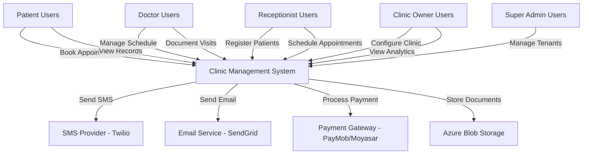
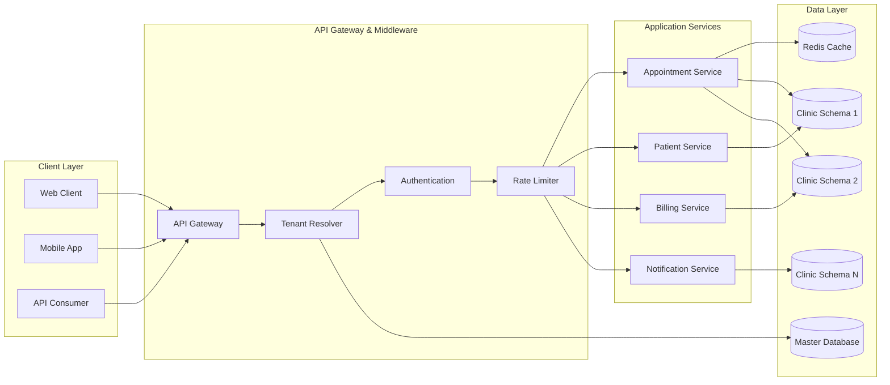
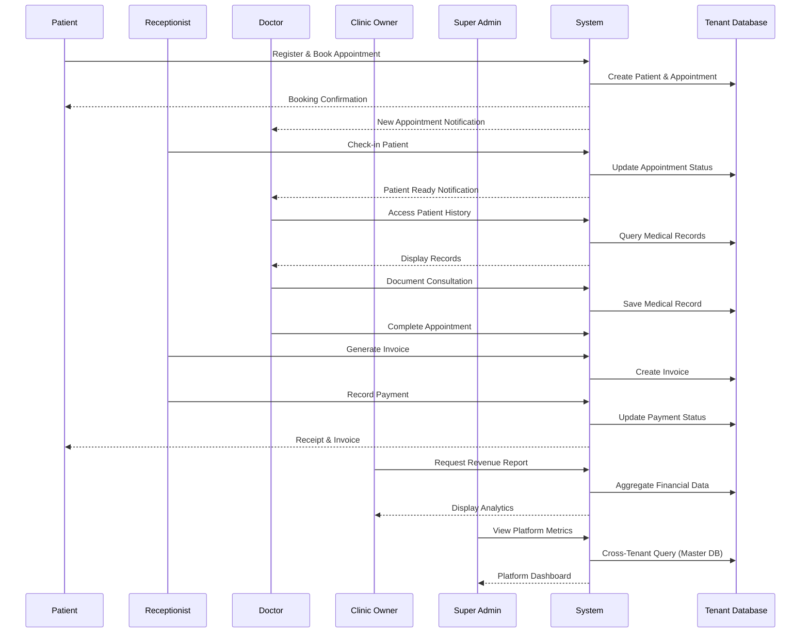
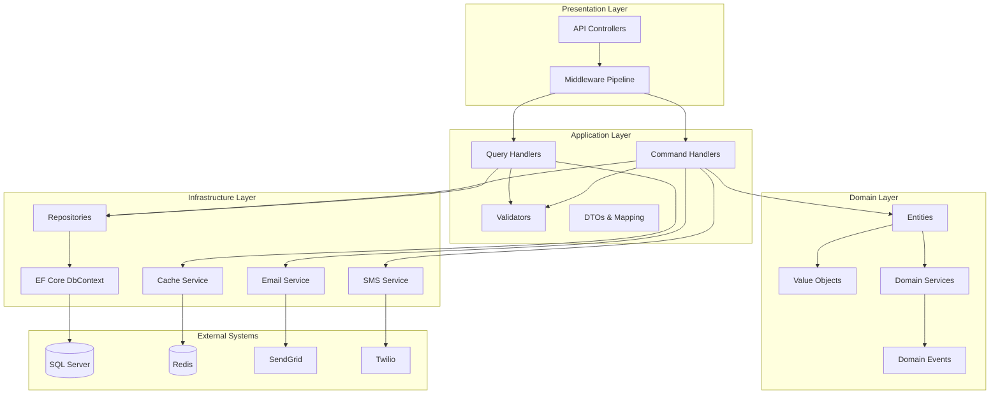
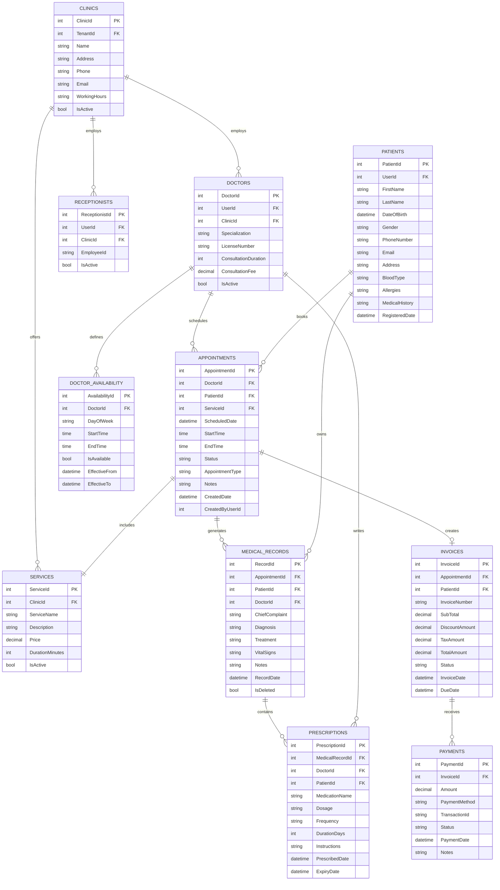
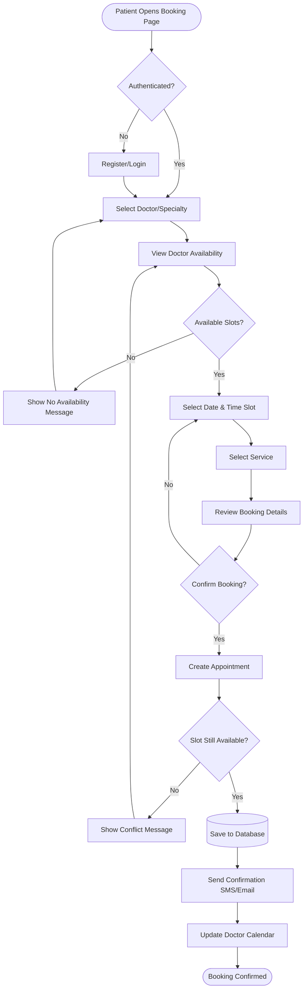
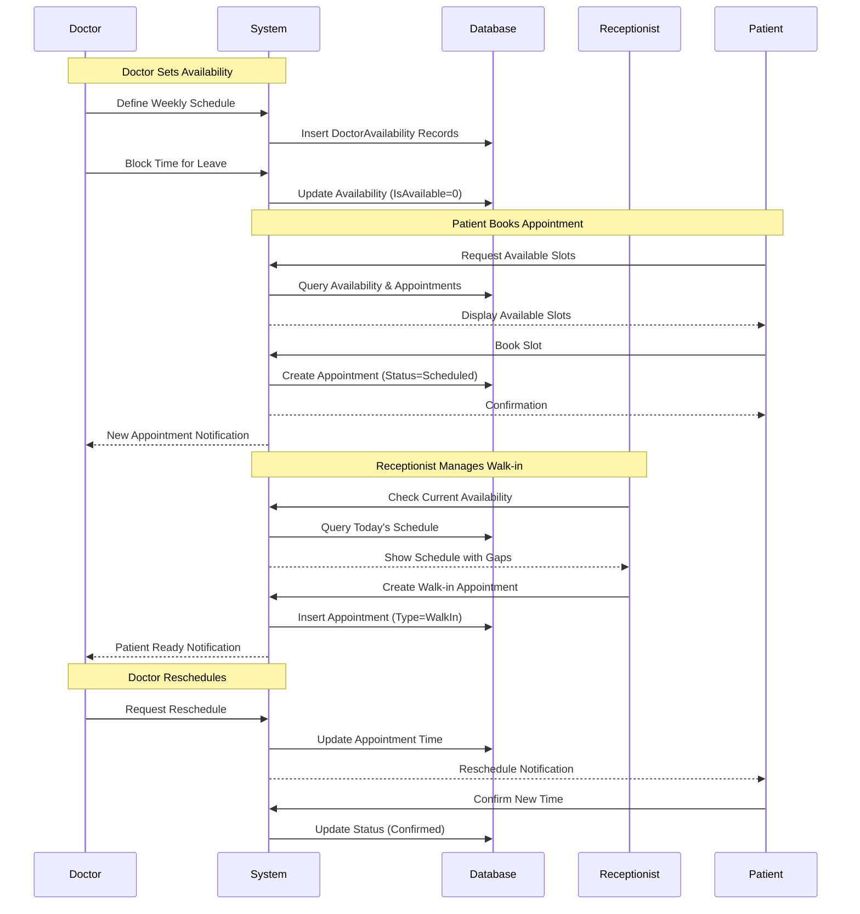
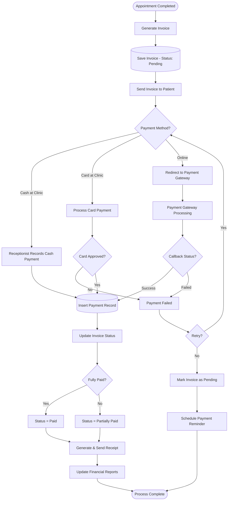
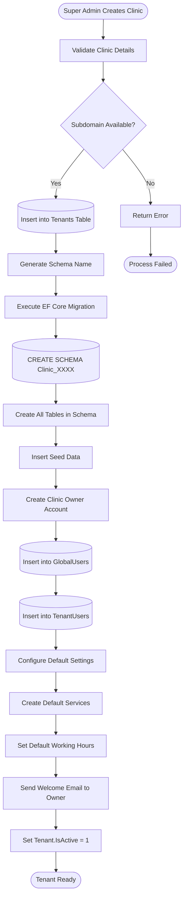
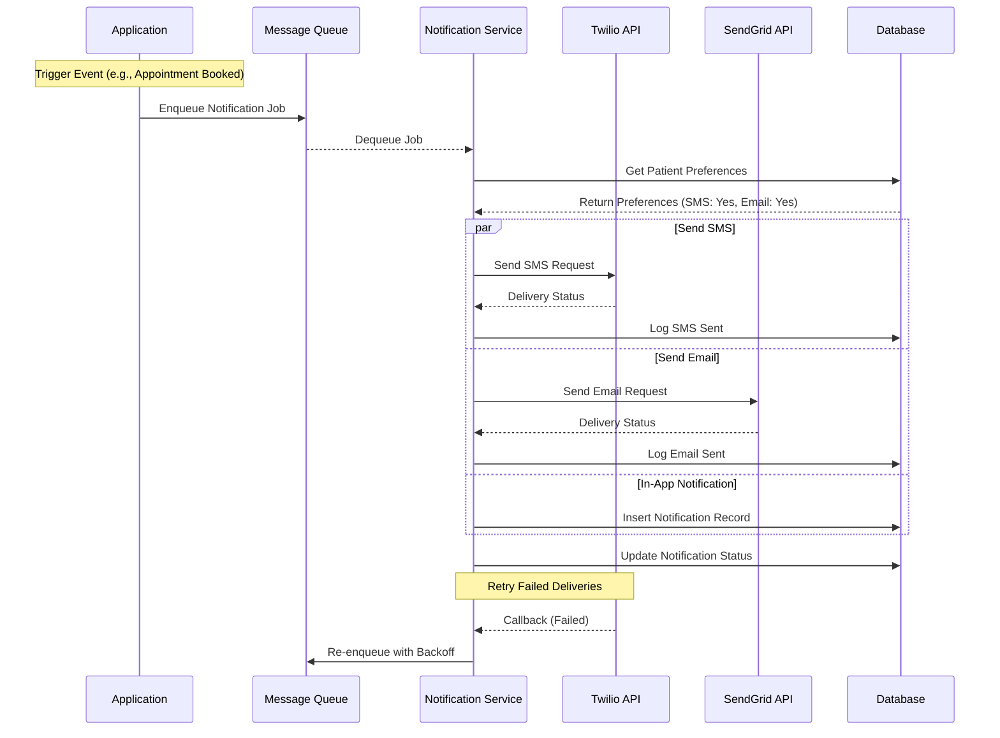

# Multi-Tenant Clinic & Booking Management System
## Technical and Business Documentation

**Document Version:** 1.0
**Date:** October 28, 2025
**Classification:** Internal - Technical Specification
**Author:** System Architecture Team

---

## Table of Contents

1. [System Overview](#1-system-overview)
2. [System Roles and Permissions](#2-system-roles-and-permissions)
3. [User Stories](#3-user-stories)
4. [Business Rules](#4-business-rules)
5. [Technical Requirements](#5-technical-requirements)
6. [High-Level Design](#6-high-level-design)
7. [Low-Level Design](#7-low-level-design)
8. [Database Design and ERD](#8-database-design-and-erd)
9. [System Flows and Scenarios](#9-system-flows-and-scenarios)
10. [Non-Functional Requirements](#10-non-functional-requirements)
11. [Future Enhancements](#11-future-enhancements)

---

## 1. System Overview

### 1.1 Purpose and Scope

This document defines the architecture, design, and implementation specifications for a multi-tenant Clinic & Booking Management System. The system provides comprehensive healthcare practice management capabilities including appointment scheduling, patient management, medical records, billing, and administrative operations.

### 1.2 Business Objectives

The platform addresses critical operational challenges faced by medical practices in the Egyptian and MENA markets:

- **Operational Efficiency**: Streamline appointment scheduling, patient registration, and billing processes
- **Multi-Clinic Support**: Enable healthcare organizations to manage multiple locations under unified administration
- **Patient Engagement**: Provide patients with self-service capabilities for booking, records access, and payment
- **Revenue Management**: Track income, generate invoices, and manage payment processing
- **Clinical Documentation**: Maintain comprehensive patient medical histories and prescription records
- **Communication Automation**: Facilitate automated notifications via SMS, email, and in-app messaging

### 1.3 Target Market

Primary focus on Egyptian and MENA region healthcare providers with scalability for global expansion. The system accommodates practices ranging from single-doctor clinics to multi-location healthcare networks.

### 1.4 Core Functional Areas

- **Appointment Management**: Scheduling, availability management, cancellations, and rescheduling
- **Patient Management**: Registration, demographics, medical history, and contact information
- **Clinical Operations**: Prescriptions, diagnoses, treatment plans, and medical records
- **Billing and Payments**: Invoice generation, payment processing, and financial reporting
- **Tenant Administration**: Clinic configuration, service catalog, working hours, and staff management
- **Platform Administration**: Subscription management, tenant provisioning, and system monitoring

---

## 2. System Roles and Permissions

### 2.1 Role Definitions

The system implements role-based access control (RBAC) with five primary roles, each scoped to appropriate data boundaries.

#### 2.1.1 Super Admin

**Scope**: Platform-wide access across all tenants

**Responsibilities**:
- Tenant lifecycle management (creation, suspension, deletion)
- Subscription plan administration and billing oversight
- Platform-level configuration and feature flags
- System health monitoring and performance analytics
- Global user management and support escalations
- Master data maintenance and reference data

**Permissions**:

| Resource | Create | Read | Update | Delete | Notes |
|----------|--------|------|--------|--------|-------|
| Tenants | ✓ | ✓ | ✓ | ✓ | Full CRUD on clinic tenants |
| Subscriptions | ✓ | ✓ | ✓ | ✓ | Manage billing and plans |
| Platform Users | ✓ | ✓ | ✓ | ✓ | Super admin accounts only |
| System Logs | - | ✓ | - | - | Read-only audit access |
| Analytics | - | ✓ | - | - | Cross-tenant reporting |
| Tenant Data | - | ✓ | - | - | Read access for support |

**Data Scope**: All schemas, master database

#### 2.1.2 Clinic Owner

**Scope**: Single tenant (clinic) administrative access

**Responsibilities**:
- Clinic profile and configuration management
- Staff and doctor account provisioning
- Service catalog and pricing management
- Working hours and availability rules
- Financial reporting and revenue analytics
- Clinic-level settings and branding

**Permissions**:

| Resource | Create | Read | Update | Delete | Notes |
|----------|--------|------|--------|--------|-------|
| Clinic Profile | - | ✓ | ✓ | - | Cannot delete own clinic |
| Doctors | ✓ | ✓ | ✓ | ✓ | Manage medical staff |
| Receptionists | ✓ | ✓ | ✓ | ✓ | Manage front-desk staff |
| Services | ✓ | ✓ | ✓ | ✓ | Service catalog management |
| Appointments | - | ✓ | ✓ | ✓ | View and modify all appointments |
| Patients | - | ✓ | ✓ | - | View patient demographics |
| Medical Records | - | ✓ | - | - | Read-only clinical data |
| Invoices | - | ✓ | ✓ | - | Financial oversight |
| Reports | - | ✓ | - | - | Analytics and dashboards |

**Data Scope**: Single tenant schema

#### 2.1.3 Doctor

**Scope**: Personal schedule and assigned patients within tenant

**Responsibilities**:
- Personal availability and schedule management
- Appointment acceptance and management
- Medical record creation and updates
- Prescription writing and diagnosis entry
- Patient communication and follow-ups
- Clinical documentation

**Permissions**:

| Resource | Create | Read | Update | Delete | Notes |
|----------|--------|------|--------|--------|-------|
| Own Schedule | ✓ | ✓ | ✓ | - | Personal availability |
| Appointments | - | ✓ | ✓ | - | Own appointments only |
| Patients | - | ✓ | - | - | Assigned patients only |
| Medical Records | ✓ | ✓ | ✓ | - | Full clinical documentation |
| Prescriptions | ✓ | ✓ | ✓ | ✓ | Prescription management |
| Invoices | - | ✓ | - | - | View related invoices |
| Services | - | ✓ | - | - | View service catalog |

**Data Scope**: Own appointments and patient assignments within tenant

#### 2.1.4 Receptionist

**Scope**: Front-desk operations within tenant

**Responsibilities**:
- Patient registration and check-in
- Appointment scheduling across all doctors
- Walk-in patient management
- Payment collection and invoice generation
- Schedule coordination and conflict resolution
- Patient communication and reminders

**Permissions**:

| Resource | Create | Read | Update | Delete | Notes |
|----------|--------|------|--------|--------|-------|
| Patients | ✓ | ✓ | ✓ | - | Patient registration |
| Appointments | ✓ | ✓ | ✓ | ✓ | Full scheduling access |
| Doctor Schedules | - | ✓ | - | - | View-only availability |
| Services | - | ✓ | - | - | Service selection for booking |
| Invoices | ✓ | ✓ | ✓ | - | Billing operations |
| Payments | ✓ | ✓ | - | - | Payment recording |
| Medical Records | - | ✓ | - | - | Limited view for context |

**Data Scope**: All clinic operations within tenant, no medical record editing

#### 2.1.5 Patient

**Scope**: Personal health records and appointments

**Responsibilities**:
- Self-registration and profile management
- Appointment booking and cancellation
- Medical record access
- Invoice viewing and payment
- Communication with clinic staff

**Permissions**:

| Resource | Create | Read | Update | Delete | Notes |
|----------|--------|------|--------|--------|-------|
| Own Profile | ✓ | ✓ | ✓ | - | Personal information |
| Appointments | ✓ | ✓ | ✓ | ✓ | Own appointments only |
| Medical Records | - | ✓ | - | - | Read-only access |
| Prescriptions | - | ✓ | - | - | View own prescriptions |
| Invoices | - | ✓ | - | - | View own invoices |
| Payments | ✓ | ✓ | - | - | Make payments |
| Doctor Availability | - | ✓ | - | - | View for booking |

**Data Scope**: Personal records only within tenant

---

## 3. User Stories

### 3.1 Super Admin Stories

#### Platform Management and Administration
**As a system admin, I want to manage clinic registrations and subscriptions so that I can control which clinics have active access.**
- Review and approve new clinic registration applications
- Configure subscription plans and pricing tiers
- Monitor subscription renewal and expiry dates
- Manage clinic access levels and feature permissions
- Handle subscription upgrades and downgrades

**As a system admin, I want to approve or deactivate clinics to ensure compliance with system policies.**
- Review clinic compliance with terms of service
- Suspend or terminate non-compliant clinics
- Monitor clinic activity and usage patterns
- Investigate and resolve policy violations
- Maintain platform security and integrity

#### Technical Support and Operations
**As a system admin, I want to handle support tickets from clinics so that I can solve operational or technical issues.**
- Ticket management and escalation system
- Technical troubleshooting and issue resolution
- Database maintenance and performance optimization
- System backup and recovery procedures
- User account management and password resets

**As a system admin, I want to view usage analytics across clinics so that I can optimize performance and resource allocation.**
- Cross-tenant performance metrics and dashboards
- Resource utilization monitoring and capacity planning
- System health monitoring and alerting
- User adoption and engagement analytics
- Revenue tracking and financial reporting

#### System Configuration
**As a system admin, I want to manage global settings (plans, limits, features) for the SaaS platform.**
- Global system configuration and feature flags
- Service level agreements and performance targets
- Integration management with third-party services
- Security policies and compliance settings
- System maintenance windows and deployment schedules

### 3.2 Clinic Owner Stories

#### Clinic Management and Configuration
**As a clinic owner, I want to manage all my clinic data (doctors, receptionists, patients) so that I can control operations.**
- Complete staff management with role-based permissions
- Patient database management and access control
- Service catalog configuration with pricing
- Clinic profile and branding customization
- Working hours and operational settings

**As a clinic owner, I want to create custom roles and permissions so that each staff member has access only to relevant features.**
- Granular permission system for different user roles
- Custom role creation based on clinic needs
- Access control for sensitive patient information
- Audit trail for all user activities
- Security settings and data protection policies

#### Analytics and Business Intelligence
**As a clinic owner, I want to view all appointments, medical records, and prescriptions created under my clinic so that I can monitor quality and compliance.**
- Comprehensive dashboard with all clinic activities
- Quality metrics and compliance monitoring
- Patient care outcome tracking
- Medical record completeness reports
- Prescription and treatment pattern analysis

**As a clinic owner, I want to generate reports about financial performance, visits, and doctors' productivity so that I can analyze my business.**
- Real-time financial dashboards and KPIs
- Revenue tracking by service, doctor, and time period
- Patient volume and visit statistics
- Doctor performance and productivity metrics
- Custom report builder with export capabilities

#### Multi-Clinic and Expansion Management
**As a clinic owner, I want to manage multiple branches under the same group so that I can monitor all operations from one dashboard.**
- Multi-location management from single interface
- Centralized patient records across branches
- Cross-clinic doctor scheduling and assignments
- Consolidated financial reporting
- Unified branding and operational standards

**As a clinic owner, I want to manage subscriptions and payments for my clinics so that I can renew or upgrade plans easily.**
- Subscription plan management and upgrades
- Payment method configuration and billing
- Usage monitoring and quota management
- Automated renewal notifications
- Invoice and payment history tracking

### 3.3 Doctor Stories

#### Schedule Management
**As a doctor, I want to create and manage my available time slots so that patients or receptionists can book appointments accordingly.**
- Define weekly availability patterns (e.g., Monday 9 AM - 5 PM, Wednesday 2 PM - 7 PM)
- Set consultation duration per service type (e.g., 15 min for follow-up, 30 min for new consultation)
- Create recurring time slots with automatic generation
- Block unavailable time for vacations, conferences, or personal commitments
- Set different availability for different days of the week

**As a doctor, I want to view my upcoming appointments in a daily or weekly schedule so that I can plan my work efficiently.**
- Calendar view with color-coded appointment types
- Filter by status (scheduled, completed, cancelled)
- Quick access to patient information from schedule
- Export schedule to personal calendar applications
- See gaps and availability at a glance

**As a doctor, I want to access each patient's previous visit history so that I can provide consistent medical care.**
- Complete medical record timeline per patient
- Previous diagnoses, treatments, and medications
- Lab results and imaging history
- Progress notes and vital signs trends
- Quick reference for recurring patients

#### Patient Care and Documentation
**As a doctor, I want to record medical notes and diagnoses after each appointment so that patient records remain complete.**
- Structured clinical note templates
- Diagnosis coding with ICD-10 support
- Treatment plans and progress notes
- Vital signs recording with trend visualization
- Auto-save and audit trail for all entries

**As a doctor, I want to upload attachments (lab results, scans, images) to patient records so that I can refer to them later.**
- Support for multiple file formats (PDF, DICOM, JPG, PNG)
- Categorization by attachment type (X-Ray, Analysis, Report)
- Secure cloud storage with patient access controls
- Version control and timestamp tracking
- Integration with lab systems for automatic result uploads

**As a doctor, I want to generate and print or send electronic prescriptions to patients so that they can easily access their medications.**
- Digital prescription creation with medication database
- Dosage instructions and duration management
- Electronic signatures and doctor credentials
- PDF generation for patient download/printing
- Integration with pharmacy systems for electronic transmission

**As a doctor, I want to follow up with patients after visits so that I can ensure their treatment progress.**
- Schedule follow-up appointments automatically
- Send treatment reminders and medication alerts
- Monitor patient progress through secure messaging
- Create follow-up task lists and reminders
- Track patient compliance and outcomes

#### Profile and Professional Management
**As a doctor, I want to update my profile (specialization, bio, certificates) so that patients and clinic owners can see my credentials.**
- Professional profile with photo and credentials
- Specialization and sub-specialty management
- Education and certification display
- Patient reviews and ratings showcase
- Professional bio and treatment philosophy

**As a doctor, I want to manage my availability settings and working hours so that the system accurately reflects my schedule.**
- Define regular working hours and exceptions
- Set vacation and leave periods
- Configure same-day appointment rules
- Manage telemedicine availability separately
- Sync with external calendar systems

### 3.4 Receptionist Stories

#### Patient Registration and Management
**As a receptionist, I want to search for patients and book appointments on their behalf so that I can manage clinic scheduling easily.**
- Quick patient search by name, phone, email, or patient ID
- View patient history and previous appointments
- Create new patient records during booking process
- Access patient demographic and contact information
- Handle walk-in patient registration and immediate booking

**As a receptionist, I want to register new patients and update their basic info so that records remain accurate.**
- Complete patient registration with all required fields
- Capture emergency contact information
- Update patient contact details and demographics
- Upload patient identification and insurance documents
- Set patient communication preferences

#### Appointment and Schedule Management
**As a receptionist, I want to view and manage the daily calendar for all doctors in the clinic so that I can coordinate appointments.**
- Unified calendar view showing all doctors' schedules
- Color-coded appointment status and types
- Real-time availability updates
- Quick appointment search and filtering
- Daily summary and appointment statistics

**As a receptionist, I want to cancel or reschedule appointments for patients when needed so that scheduling conflicts are avoided.**
- Easy appointment rescheduling with availability checking
- Cancellation with refund processing according to clinic policy
- Automatic slot availability updates upon cancellation
- Patient notification for schedule changes
- Conflict resolution and alternative slot suggestions

**As a receptionist, I want to mark attendance or no-shows for patients so that we can track booking reliability.**
- Quick check-in process for arriving patients
- Mark no-shows with automatic penalty application
- Update appointment status in real-time
- Generate daily attendance reports
- Track patient warning count and booking restrictions

#### Administrative Operations
**As a receptionist, I want to manage the clinic's appointment booking system so that operations run smoothly.**
- Set up recurring appointments for patients
- Manage appointment waiting lists and cancellations
- Handle same-day emergency bookings
- Coordinate multiple patient appointments
- Generate daily operational reports

**As a receptionist, I want to communicate with patients regarding their appointments so that they stay informed.**
- Send appointment confirmations and reminders
- Handle patient inquiries about scheduling
- Notify patients of schedule changes
- Manage patient communication preferences
- Track message delivery and responses

### 3.5 Patient Stories

#### Doctor Discovery and Selection
**As a patient, I want to view available doctors and their profiles so that I can choose the right specialist.**
- Browse doctors by specialty and expertise
- View doctor profiles with qualifications and experience
- Read patient reviews and ratings
- Check doctor availability and consultation fees
- Filter doctors by location, language, and availability

#### Appointment Booking and Management
**As a patient, I want to book an appointment with a doctor or through the receptionist so that I can get medical consultation.**
- Self-service appointment booking online
- Real-time availability display
- Multiple booking methods (web, mobile, phone)
- Appointment confirmation and reminders
- Easy rescheduling and cancellation

**As a patient, I want to receive appointment reminders or notifications so that I don't miss my visit.**
- SMS and email reminders before appointments
- Push notifications for mobile app users
- Customizable reminder timing preferences
- Calendar integration and invites
- Multiple reminder channels

#### Medical Records and Health Information
**As a patient, I want to view my appointment history and medical records so that I can track my health progress.**
- Complete medical record timeline
- Appointment history with diagnoses and treatments
- Prescription records and medication history
- Lab results and imaging reports
- Health progress tracking and trends

**As a patient, I want to download or view my diagnosis report if the clinic allows it so that I can share it if needed.**
- Secure access to medical reports
- Download prescriptions and test results
- Share medical records with other providers
- Export health data for personal records
- Access to educational health resources

#### Feedback and Reviews
**As a patient, I want to rate and review the doctor anonymously after a visit so that others can benefit from my feedback.**
- Anonymous rating system for doctors and clinic
- Detailed review submission process
- View aggregated ratings and reviews
- Feedback for service improvement
- Quality assurance and review moderation

#### Communication and Support
**As a patient, I want to get my prescription via WhatsApp, email, or print so that I can easily access my treatment details.**
- Multiple prescription delivery methods
- Electronic prescription sharing
- Printable prescription formats
- Medication instructions and reminders
- Pharmacy integration for easy refills

#### Account and Compliance Management
**As a patient, I want to be restricted from online booking after multiple no-shows so that the system encourages commitment.**
- Automatic booking restrictions after repeated no-shows
- Warning system for appointment compliance
- Appeal process for legitimate reasons
- Progressive restriction levels
- Reinstatement after compliance improvement

### 3.6 System Admin Stories (Platform Operations)

**As a system admin, I want to manage clinic registrations and subscriptions so that I can control which clinics have active access.**
- Review and approve new clinic registration applications
- Configure subscription plans and pricing tiers
- Monitor subscription renewal and expiry dates
- Manage clinic access levels and feature permissions
- Handle subscription upgrades and downgrades

**As a system admin, I want to approve or deactivate clinics to ensure compliance with system policies.**
- Review clinic compliance with terms of service
- Suspend or terminate non-compliant clinics
- Monitor clinic activity and usage patterns
- Investigate and resolve policy violations
- Maintain platform security and integrity

**As a system admin, I want to handle support tickets from clinics so that I can solve operational or technical issues.**
- Ticket management and escalation system
- Technical troubleshooting and issue resolution
- Database maintenance and performance optimization
- System backup and recovery procedures
- User account management and password resets

**As a system admin, I want to view usage analytics across clinics so that I can optimize performance and resource allocation.**
- Cross-tenant performance metrics and dashboards
- Resource utilization monitoring and capacity planning
- System health monitoring and alerting
- User adoption and engagement analytics
- Revenue tracking and financial reporting

**As a system admin, I want to manage global settings (plans, limits, features) for the SaaS platform.**
- Global system configuration and feature flags
- Service level agreements and performance targets
- Integration management with third-party services
- Security policies and compliance settings
- System maintenance windows and deployment schedules

### 3.7 Future Automation and Chatbot Features

#### Intelligent Appointment Management
**As a chatbot, I want to allow patients to book appointments automatically based on doctor availability so that reception workload is reduced.**
- Natural language appointment booking via chat
- Automatic doctor recommendation based on symptoms
- Real-time availability checking and slot reservation
- Intelligent appointment scheduling optimization
- Multi-language support for patient interactions

**As a chatbot, I want to confirm available slots from the doctor's schedule so that appointments are always up-to-date.**
- Real-time schedule synchronization
- Automatic conflict detection and resolution
- Instant booking confirmations
- Schedule updates and notifications
- Integration with doctor calendar systems

**As a chatbot, I want to handle emergency booking logic when clinics allow it.**
- Emergency triage and priority assessment
- Immediate doctor notification for urgent cases
- Emergency slot creation and management
- Alternative care provider suggestions
- Crisis handling and escalation procedures

#### Automated Patient Support
**As an automated system, I want to handle routine patient inquiries so that staff can focus on complex issues.**
- FAQ automation and instant responses
- Appointment information and directions
- Prescription refill requests
- Basic medical information and education
- Symptom assessment and self-care guidance

**As an intelligent system, I want to predict appointment cancellations and no-shows so that clinics can optimize scheduling.**
- Machine learning prediction models
- Proactive patient outreach and reminders
- Dynamic overbooking strategies
- Schedule optimization algorithms
- Risk assessment and intervention

### 3.8 System Behavior and Rules

#### Appointment Management Rules
**A patient can only have one active appointment per doctor at a time.**
- System validation during booking process
- Automatic conflict detection and prevention
- Clear error messaging for patients
- Exception handling for emergency cases

**Doctors cannot edit or delete completed appointments.**
- Immutable appointment history after completion
- Audit trail for all appointment modifications
- Role-based editing permissions
- Data integrity preservation

**Receptionists can only manage data inside their assigned clinic.**
- Strict tenant isolation enforcement
- Role-based access control validation
- Cross-clinic data access prevention
- Security audit logging

**Owners can view all data under their clinic, including doctors' activities.**
- Complete clinic oversight capabilities
- Comprehensive reporting and analytics
- Staff performance monitoring
- Operational transparency

**A patient who misses 3 appointments loses online booking privileges.**
- Automatic booking restriction system
- Progressive warning notifications
- Appeal and reinstatement process
- Staff override capabilities

#### Data Management Rules
**Attachments are stored on external storage (like Cloudinary).**
- Secure cloud storage integration
- File access control and permissions
- Backup and disaster recovery
- Content delivery optimization

**All financial reports are visible only to the clinic owner.**
- Strict financial data access control
- Role-based report visibility
- Confidential information protection
- Audit trail for financial access

#### System Integrity Rules
**Patient warning count increments automatically for no-shows.**
- Automated attendance tracking
- Progressive warning system
- Configurable warning thresholds
- Staff notification for intervention

**Appointment status updates trigger cascading notifications.**
- Real-time status synchronization
- Multi-channel notification delivery
- Stakeholder alert system
- Audit trail maintenance

**Medical record access requires proper authorization and audit logging.**
- Strict access control enforcement
- Comprehensive audit logging
- Role-based permission validation
- Security incident detection
- As a system, I must prevent double-booking of doctors for overlapping time slots
- As a receptionist, I must be notified when attempting to book an appointment that would exceed clinic capacity
- As a doctor, I must be able to override my schedule for emergency cases with appropriate justification

#### Cancellations and No-Shows
- As a patient, I cannot cancel an appointment less than 2 hours before the scheduled time without penalty
- As a clinic owner, I can define cancellation policies including fees and refund rules
- As a receptionist, I can mark patients as no-shows and apply configured penalties
- As a system, I must automatically release cancelled slots for rebooking

#### Payment Failures
- As a patient, I must be notified if my online payment fails and provided with alternative payment methods
- As a receptionist, I can create appointments with pending payment status for trusted patients
- As a clinic owner, I can set rules for allowing appointments with outstanding balances

#### Multi-Clinic Scenarios
- As a doctor, I can belong to multiple clinics and manage separate schedules for each
- As a patient, I can book appointments at different clinics without creating multiple accounts
- As a system, I must maintain data isolation between clinic schemas despite shared user accounts

#### Data Integrity
- As a system, I must prevent deletion of appointments with associated medical records
- As a system, I must maintain audit trails of all modifications to medical records
- As a system, I must validate tenant context before any database operation to prevent cross-tenant data leakage

---

## 4. Business Rules

### 4.1 Multi-Tenancy Rules

1. **Schema Isolation**: Each clinic tenant operates within a dedicated database schema with complete data isolation
2. **Tenant Identification**: All requests must include tenant context (subdomain, header, or claim-based identification)
3. **Shared User Accounts**: Users (patients, doctors) may belong to multiple tenants but data remains isolated per tenant
4. **Schema Provisioning**: New tenant schemas are created automatically upon clinic registration with seed data
5. **Master Database**: Contains tenant registry, subscription information, and global configuration

### 4.2 Appointment Rules

6. **No Overlapping Appointments**: A doctor cannot have overlapping appointments; the system enforces time slot exclusivity
7. **Availability Validation**: Appointments can only be booked during doctor-defined available hours
8. **Booking Window**: Patients can book appointments up to 30 days in advance (configurable per clinic)
9. **Minimum Notice**: Appointments require minimum advance notice (configurable, default 1 hour)
10. **Duration Enforcement**: Appointment duration must match service-defined or doctor-configured consultation time
11. **Same-Day Limit**: Patients cannot book more than 3 appointments with the same doctor on the same day (anti-abuse)

### 4.3 Cancellation and Rescheduling Rules

12. **Cancellation Window**: Patients can cancel without penalty up to 24 hours before appointment (configurable)
13. **Late Cancellation Fee**: Cancellations within restricted window may incur penalties per clinic policy
14. **Rescheduling Limits**: Patients can reschedule the same appointment up to 2 times (configurable)
15. **No-Show Policy**: Patients marked as no-show for 3 consecutive appointments may face booking restrictions
16. **Doctor Cancellation**: Doctor-initiated cancellations do not penalize patients and trigger automatic notifications

### 4.4 Billing and Payment Rules

17. **Invoice Generation**: An invoice is automatically created upon appointment completion or service delivery
18. **Payment Methods**: Clinics define accepted payment methods (cash, card, online, insurance)
19. **Payment Timing**: Payment can be collected before, during, or after appointment per clinic policy
20. **Partial Payments**: System supports partial payments with tracking of outstanding balance
21. **Refund Processing**: Refunds for cancelled appointments follow clinic-defined refund policies
22. **Price Lock**: Service prices are locked at booking time; price changes do not affect existing appointments

### 4.5 User and Access Rules

23. **Single Clinic Owner**: Each clinic has exactly one primary owner; secondary administrators can be designated
24. **Doctor Multi-Clinic**: Doctors can be associated with multiple clinics with independent schedules
25. **Patient Account Linking**: Patient accounts are created globally but appointments and records are tenant-specific
26. **Role Assignment**: Users can have different roles in different tenants (e.g., doctor in Clinic A, patient in Clinic B)
27. **Account Deactivation**: Deactivated users retain historical data but cannot access system or make new appointments

### 4.6 Medical Record Rules

28. **Immutability**: Medical records cannot be deleted, only amended with audit trail
29. **Doctor Ownership**: Only the attending doctor can create or modify medical records for their appointments
30. **Patient Access**: Patients have read-only access to their own medical records
31. **Record Linking**: All medical records must be linked to a specific appointment or visit
32. **Prescription Validity**: Prescriptions include validity period; expired prescriptions are marked as inactive

### 4.7 Data Normalization and Integrity

33. **Third Normal Form**: Database schema adheres to 3NF to eliminate data redundancy
34. **Referential Integrity**: Foreign key constraints enforce relationships; cascading deletes only where appropriate
35. **Soft Deletes**: Critical entities (appointments, patients, medical records) use soft delete for audit purposes
36. **Unique Constraints**: Email and phone numbers must be unique per tenant; patient ID is globally unique
37. **Temporal Consistency**: All timestamps stored in UTC; timezone conversion handled at presentation layer

### 4.8 Subscription and Billing Rules

38. **Subscription Required**: Clinics must have active subscription to access system features
39. **Grace Period**: Expired subscriptions have 7-day grace period before access suspension
40. **Feature Tiering**: Premium features (analytics, integrations) available only on higher subscription tiers
41. **User Limits**: Subscription plans define maximum doctors, receptionists, and monthly appointments
42. **Billing Cycle**: Subscriptions billed monthly or annually; pro-rated for mid-cycle changes

### 4.9 Notification Rules

43. **Appointment Reminders**: Automated reminders sent 24 hours and 1 hour before appointment (configurable)
44. **Opt-Out Support**: Patients can configure notification preferences; emergency notifications cannot be disabled
45. **Multi-Channel**: Notifications delivered via SMS, email, and in-app; channel selection per notification type
46. **Delivery Verification**: System tracks notification delivery status and retries on failure

### 4.10 Operational Rules

47. **Working Hours**: Clinics define operational days and hours; appointments cannot be booked outside working hours
48. **Service Catalog**: Each clinic maintains independent service catalog with pricing and descriptions
49. **Doctor Specialization**: Doctors are assigned specializations; services linked to appropriate specializations
50. **Emergency Override**: Authorized staff can override scheduling rules for emergency cases with mandatory documentation

---

## 5. Technical Requirements

### 5.1 Architecture Pattern

**Clean Architecture (N-Tier)** with strict dependency inversion:
- **Domain Layer**: Core business logic, entities, and domain events (no external dependencies)
- **Application Layer**: Use cases, DTOs, interfaces, validation, and business workflows
- **Infrastructure Layer**: Data access, external integrations, caching, and cross-cutting concerns
- **Presentation Layer**: API controllers, request/response models, authentication middleware

Dependency flow: Presentation → Application → Domain ← Infrastructure

### 5.2 Technology Stack

#### Backend Framework
- **Runtime**: ASP.NET 8.0 (LTS)
- **API Pattern**: RESTful Web API with versioning support
- **Language**: C# 12
- **SDK**: .NET 8.0 SDK

#### Data Access
- **Database**: Microsoft SQL Server 2022
- **ORM**: Entity Framework Core 8.0
- **Multi-Tenancy**: Schema-per-tenant with dynamic connection string resolution
- **Migration**: EF Core Migrations with tenant-specific execution
- **Querying**: LINQ with query optimization and compiled queries for performance

#### Authentication and Authorization
- **Identity Framework**: ASP.NET Core Identity
- **Token Standard**: JWT (JSON Web Tokens)
- **Token Storage**: HttpOnly cookies for web clients, bearer tokens for mobile/API
- **Claims-Based Authorization**: Role and policy-based access control
- **Tenant Context**: Tenant ID embedded in JWT claims for multi-tenant scoping

#### Caching
- **Distributed Cache**: Redis 7.x
- **Cache Patterns**: Cache-aside, read-through for frequently accessed data
- **Cache Scope**: Tenant-specific cache keys to prevent cross-tenant cache pollution
- **Expiration Policy**: Sliding expiration for user sessions, absolute for static data

#### Logging and Monitoring
- **Logging Framework**: Serilog with structured logging
- **Sinks**: Console, File (rolling), SQL Server (audit logs)
- **Log Levels**: Information, Warning, Error, Critical with environment-specific configuration
- **Correlation**: Request correlation IDs for distributed tracing

#### External Integrations
- **Email Service**: SendGrid API for transactional emails
- **SMS Provider**: Twilio API for SMS notifications
- **Payment Gateway**: PayMob (Egypt), Moyasar (KSA) with abstraction for multi-provider support
- **File Storage**: Azure Blob Storage for medical documents and images

#### Hosting and Infrastructure
- **Primary Platform**: Microsoft Azure
  - Azure App Service for API hosting
  - Azure SQL Database with elastic pools for tenant schemas
  - Azure Redis Cache for distributed caching
  - Azure Key Vault for secrets management
- **Alternative Platform**: STC Cloud (Saudi Arabia) for regional compliance
- **Container Support**: Docker with orchestration-ready configuration

#### Frontend (Optional)
- **Framework**: React 18 or Next.js 14
- **State Management**: Redux Toolkit or Zustand
- **UI Library**: Material-UI or Ant Design with RTL support for Arabic
- **API Client**: Axios with tenant header injection

### 5.3 Multi-Tenant Implementation Strategy

#### Tenant Identification
```
1. Request arrives with tenant identifier (subdomain, custom header, or path parameter)
2. Middleware extracts tenant context and validates against tenant registry
3. Tenant ID added to HttpContext for downstream access
4. Connection string resolved from tenant configuration
5. EF Core DbContext configured with tenant-specific schema
```

#### Schema Management
- **Master Database**: `ClinicMaster`
  - Tables: Tenants, Subscriptions, GlobalUsers, TenantConfiguration
  - Connection string: Primary SQL Server instance

- **Tenant Schemas**: `Clinic_{TenantId}` (e.g., `Clinic_1001`)
  - Independent schemas within shared database or separate databases per tier
  - Identical schema structure across all tenants
  - Applied via parameterized migrations

#### Connection Resolution
```csharp
// Middleware Pipeline
TenantResolutionMiddleware → TenantValidationMiddleware → DbContextConfiguration

// DbContext Factory Pattern
services.AddDbContext<ClinicDbContext>((serviceProvider, options) =>
{
    var tenantService = serviceProvider.GetRequiredService<ITenantService>();
    var connectionString = tenantService.GetConnectionString();
    options.UseSqlServer(connectionString, sqlOptions =>
    {
        sqlOptions.MigrationsHistoryTable("__EFMigrationsHistory", tenantService.GetSchemaName());
    });
});
```

#### Tenant Onboarding Process
1. Super admin creates tenant record in master database
2. Subscription plan assigned and validated
3. Schema created via EF Core migration execution
4. Seed data inserted (default services, working hours, admin account)
5. Tenant configuration finalized (custom domain, branding)
6. Clinic owner receives credentials and onboarding email

### 5.4 Database Configuration

#### Performance Optimization
- **Indexing Strategy**:
  - Clustered indexes on primary keys
  - Non-clustered indexes on foreign keys and frequently queried columns
  - Composite indexes for multi-column queries (e.g., DoctorId + AppointmentDate)
- **Query Optimization**:
  - AsNoTracking for read-only queries
  - Include/ThenInclude for eager loading to reduce N+1 queries
  - Projection to DTOs to minimize data transfer
- **Connection Pooling**: Enabled with max pool size configuration per tenant load

#### Backup and Recovery
- **Backup Frequency**: Daily full backup, hourly differential (per tenant or shared based on tier)
- **Retention Policy**: 30 days point-in-time recovery for premium tiers
- **Disaster Recovery**: Geo-redundant backup for Azure SQL Database

### 5.5 Security Requirements

- **Transport Security**: TLS 1.3 for all API communications
- **Data Encryption**:
  - At rest: Transparent Data Encryption (TDE) for SQL Server
  - In transit: HTTPS/TLS
  - Sensitive fields: Application-level encryption for PII
- **Password Policy**:
  - Minimum 8 characters with complexity requirements
  - Hashed using ASP.NET Core Identity (PBKDF2 with salt)
- **API Security**:
  - Rate limiting per tenant and user
  - CORS policy configuration
  - API key validation for external integrations
- **Tenant Isolation**:
  - Query filters to prevent cross-tenant data access
  - Validation middleware to enforce tenant context
  - Security testing for tenant boundary violations

### 5.6 Development and Deployment

#### Version Control
- **Repository**: Git with GitFlow branching strategy
- **Branches**: main (production), develop (integration), feature/* (development)

#### CI/CD Pipeline
- **Build**: Automated build on commit with unit test execution
- **Deployment Stages**: Development → Staging → Production
- **Database Migrations**: Automated execution with rollback capability
- **Environment Configuration**: Azure Key Vault for secrets, appsettings per environment

#### Testing Strategy
- **Unit Tests**: xUnit for domain and application logic (target 80% coverage)
- **Integration Tests**: In-memory database and TestServer for API testing
- **End-to-End Tests**: Selenium or Playwright for critical user journeys
- **Multi-Tenant Tests**: Dedicated tests for tenant isolation and data segregation

---

## 6. High-Level Design

### 6.1 Architectural Overview

The system implements Clean Architecture principles with clear separation of concerns and dependency inversion. Each layer has distinct responsibilities and maintains strict boundaries.

#### Layer Responsibilities

**Domain Layer** (Core)
- Contains enterprise business logic and rules
- Defines entities, value objects, domain events, and domain services
- Framework-agnostic with zero external dependencies
- Represents the heart of the business model

**Application Layer** (Use Cases)
- Orchestrates domain objects to fulfill use cases
- Defines application service interfaces (repositories, external services)
- Contains DTOs, validators, and mapping configurations
- Implements CQRS pattern where appropriate (commands and queries)

**Infrastructure Layer** (External Concerns)
- Implements interfaces defined in application layer
- EF Core repository implementations
- External service integrations (email, SMS, payment)
- Data persistence, caching, and file storage
- Cross-cutting concerns (logging, monitoring)

**Presentation Layer** (API/UI)
- ASP.NET 8 Web API controllers
- Request/response models (different from DTOs)
- Authentication and authorization middleware
- API versioning and documentation (Swagger/OpenAPI)
- Exception handling and response formatting

### 6.2 System Context Diagram



### 6.3 Multi-Tenant Architecture



### 6.4 Role-Based Data Flow



### 6.5 Component Interaction



---

## 7. Low-Level Design

### 7.1 Solution Structure

```
ClinicManagement.sln
│
├── src/
│   ├── Core/
│   │   ├── ClinicManagement.Domain/
│   │   │   ├── Entities/
│   │   │   │   ├── Tenant.cs
│   │   │   │   ├── User.cs
│   │   │   │   ├── Clinic.cs
│   │   │   │   ├── Doctor.cs
│   │   │   │   ├── Patient.cs
│   │   │   │   ├── Appointment.cs
│   │   │   │   ├── MedicalRecord.cs
│   │   │   │   ├── Prescription.cs
│   │   │   │   ├── Invoice.cs
│   │   │   │   ├── Payment.cs
│   │   │   │   ├── Service.cs
│   │   │   │   └── Notification.cs
│   │   │   ├── ValueObjects/
│   │   │   │   ├── Address.cs
│   │   │   │   ├── PhoneNumber.cs
│   │   │   │   ├── Money.cs
│   │   │   │   └── TimeSlot.cs
│   │   │   ├── Enums/
│   │   │   │   ├── AppointmentStatus.cs
│   │   │   │   ├── PaymentMethod.cs
│   │   │   │   └── UserRole.cs
│   │   │   ├── Events/
│   │   │   │   ├── AppointmentBookedEvent.cs
│   │   │   │   ├── AppointmentCancelledEvent.cs
│   │   │   │   └── PaymentReceivedEvent.cs
│   │   │   └── Interfaces/
│   │   │       └── IAggregateRoot.cs
│   │   │
│   │   └── ClinicManagement.Application/
│   │       ├── Common/
│   │       │   ├── Interfaces/
│   │       │   │   ├── IClinicDbContext.cs
│   │       │   │   ├── ITenantService.cs
│   │       │   │   ├── IDateTime.cs
│   │       │   │   ├── IEmailService.cs
│   │       │   │   └── ISMSService.cs
│   │       │   ├── Behaviours/
│   │       │   │   ├── ValidationBehaviour.cs
│   │       │   │   └── LoggingBehaviour.cs
│   │       │   └── Exceptions/
│   │       │       ├── ValidationException.cs
│   │       │       └── NotFoundException.cs
│   │       ├── DTOs/
│   │       │   ├── Appointment/
│   │       │   ├── Patient/
│   │       │   ├── Doctor/
│   │       │   └── Invoice/
│   │       ├── UseCases/
│   │       │   ├── Appointments/
│   │       │   │   ├── Commands/
│   │       │   │   │   ├── CreateAppointment/
│   │       │   │   │   │   ├── CreateAppointmentCommand.cs
│   │       │   │   │   │   ├── CreateAppointmentCommandHandler.cs
│   │       │   │   │   │   └── CreateAppointmentValidator.cs
│   │       │   │   │   └── CancelAppointment/
│   │       │   │   └── Queries/
│   │       │   │       └── GetDoctorAvailability/
│   │       │   ├── Patients/
│   │       │   ├── Doctors/
│   │       │   └── Billing/
│   │       └── Mappings/
│   │           └── MappingProfile.cs
│   │
│   ├── Infrastructure/
│   │   └── ClinicManagement.Infrastructure/
│   │       ├── Persistence/
│   │       │   ├── ClinicDbContext.cs
│   │       │   ├── MasterDbContext.cs
│   │       │   ├── Configurations/
│   │       │   │   ├── AppointmentConfiguration.cs
│   │       │   │   ├── PatientConfiguration.cs
│   │       │   │   └── DoctorConfiguration.cs
│   │       │   ├── Repositories/
│   │       │   │   ├── AppointmentRepository.cs
│   │       │   │   └── PatientRepository.cs
│   │       │   └── Migrations/
│   │       ├── Services/
│   │       │   ├── TenantService.cs
│   │       │   ├── DateTimeService.cs
│   │       │   ├── EmailService.cs
│   │       │   └── SMSService.cs
│   │       ├── Identity/
│   │       │   └── IdentityService.cs
│   │       └── Caching/
│   │           └── RedisCacheService.cs
│   │
│   └── Presentation/
│       └── ClinicManagement.API/
│           ├── Controllers/
│           │   ├── v1/
│           │   │   ├── AppointmentsController.cs
│           │   │   ├── PatientsController.cs
│           │   │   ├── DoctorsController.cs
│           │   │   └── BillingController.cs
│           │   └── Admin/
│           │       └── TenantsController.cs
│           ├── Middleware/
│           │   ├── TenantResolutionMiddleware.cs
│           │   ├── ExceptionHandlingMiddleware.cs
│           │   └── RequestLoggingMiddleware.cs
│           ├── Filters/
│           │   └── ApiExceptionFilterAttribute.cs
│           ├── Models/
│           │   ├── Requests/
│           │   └── Responses/
│           ├── appsettings.json
│           └── Program.cs
│
└── tests/
    ├── ClinicManagement.Domain.Tests/
    ├── ClinicManagement.Application.Tests/
    └── ClinicManagement.API.Tests/
```

### 7.2 Dependency Flow

```
API Layer (Presentation)
    ↓ depends on
Application Layer
    ↓ depends on
Domain Layer (Core)
    ↑ implemented by
Infrastructure Layer
```

**Key Principles:**
- Domain has zero external dependencies
- Application defines interfaces, Infrastructure implements them
- Presentation depends only on Application and registers Infrastructure via DI
- Infrastructure accesses Domain only through Application interfaces

### 7.3 Use Case Example: Create Appointment

#### Request Flow
```
Client Request → API Controller → Command Handler → Domain Validation → Repository → Database
```

#### Implementation Details

**1. API Controller** (`AppointmentsController.cs`)
```csharp
[ApiController]
[Route("api/v1/[controller]")]
[Authorize]
public class AppointmentsController : ControllerBase
{
    private readonly IMediator _mediator;

    [HttpPost]
    [ProducesResponseType(typeof(AppointmentDto), StatusCodes.Status201Created)]
    public async Task<IActionResult> Create([FromBody] CreateAppointmentRequest request)
    {
        var command = new CreateAppointmentCommand
        {
            DoctorId = request.DoctorId,
            PatientId = request.PatientId,
            ServiceId = request.ServiceId,
            ScheduledDate = request.ScheduledDate,
            ScheduledTime = request.ScheduledTime
        };

        var result = await _mediator.Send(command);
        return CreatedAtAction(nameof(GetById), new { id = result.Id }, result);
    }
}
```

**2. Command** (`CreateAppointmentCommand.cs`)
```csharp
public class CreateAppointmentCommand : IRequest<AppointmentDto>
{
    public int DoctorId { get; set; }
    public int PatientId { get; set; }
    public int ServiceId { get; set; }
    public DateTime ScheduledDate { get; set; }
    public TimeSpan ScheduledTime { get; set; }
}
```

**3. Validator** (`CreateAppointmentValidator.cs`)
```csharp
public class CreateAppointmentValidator : AbstractValidator<CreateAppointmentCommand>
{
    public CreateAppointmentValidator()
    {
        RuleFor(x => x.DoctorId).GreaterThan(0);
        RuleFor(x => x.PatientId).GreaterThan(0);
        RuleFor(x => x.ScheduledDate).GreaterThan(DateTime.Today);
        RuleFor(x => x.ScheduledTime).Must(BeValidTimeSlot);
    }
}
```

**4. Command Handler** (`CreateAppointmentCommandHandler.cs`)
```csharp
public class CreateAppointmentCommandHandler : IRequestHandler<CreateAppointmentCommand, AppointmentDto>
{
    private readonly IClinicDbContext _context;
    private readonly ITenantService _tenantService;
    private readonly INotificationService _notificationService;

    public async Task<AppointmentDto> Handle(CreateAppointmentCommand request, CancellationToken cancellationToken)
    {
        // 1. Validate doctor availability
        var isAvailable = await _context.Appointments
            .Where(a => a.DoctorId == request.DoctorId
                     && a.ScheduledDate == request.ScheduledDate
                     && a.Status != AppointmentStatus.Cancelled)
            .AllAsync(a => !a.TimeSlot.OverlapsWith(request.ScheduledTime), cancellationToken);

        if (!isAvailable)
            throw new BusinessRuleViolationException("Doctor is not available at this time");

        // 2. Create appointment entity
        var appointment = new Appointment
        {
            DoctorId = request.DoctorId,
            PatientId = request.PatientId,
            ServiceId = request.ServiceId,
            ScheduledDate = request.ScheduledDate,
            TimeSlot = new TimeSlot(request.ScheduledTime, request.ScheduledTime.Add(TimeSpan.FromMinutes(30))),
            Status = AppointmentStatus.Scheduled,
            TenantId = _tenantService.GetTenantId()
        };

        // 3. Persist to database
        _context.Appointments.Add(appointment);
        await _context.SaveChangesAsync(cancellationToken);

        // 4. Raise domain event
        appointment.AddDomainEvent(new AppointmentBookedEvent(appointment.Id));

        // 5. Send notifications
        await _notificationService.SendAppointmentConfirmation(appointment);

        // 6. Return DTO
        return _mapper.Map<AppointmentDto>(appointment);
    }
}
```

**5. Domain Entity** (`Appointment.cs`)
```csharp
public class Appointment : AuditableEntity, IAggregateRoot
{
    public int Id { get; private set; }
    public int TenantId { get; set; }
    public int DoctorId { get; set; }
    public int PatientId { get; set; }
    public int ServiceId { get; set; }
    public DateTime ScheduledDate { get; set; }
    public TimeSlot TimeSlot { get; set; }
    public AppointmentStatus Status { get; private set; }

    public virtual Doctor Doctor { get; set; }
    public virtual Patient Patient { get; set; }
    public virtual Service Service { get; set; }

    public void Cancel(string reason)
    {
        if (Status == AppointmentStatus.Completed)
            throw new InvalidOperationException("Cannot cancel completed appointment");

        Status = AppointmentStatus.Cancelled;
        AddDomainEvent(new AppointmentCancelledEvent(Id, reason));
    }
}
```

**6. Repository** (`IClinicDbContext.cs` - Application Layer Interface)
```csharp
public interface IClinicDbContext
{
    DbSet<Appointment> Appointments { get; }
    DbSet<Patient> Patients { get; }
    DbSet<Doctor> Doctors { get; }

    Task<int> SaveChangesAsync(CancellationToken cancellationToken);
}
```

**7. Infrastructure Implementation** (`ClinicDbContext.cs`)
```csharp
public class ClinicDbContext : DbContext, IClinicDbContext
{
    private readonly ITenantService _tenantService;

    public ClinicDbContext(DbContextOptions<ClinicDbContext> options, ITenantService tenantService)
        : base(options)
    {
        _tenantService = tenantService;
    }

    public DbSet<Appointment> Appointments { get; set; }
    public DbSet<Patient> Patients { get; set; }

    protected override void OnModelCreating(ModelBuilder modelBuilder)
    {
        modelBuilder.HasDefaultSchema(_tenantService.GetSchemaName());

        // Apply configurations
        modelBuilder.ApplyConfigurationsFromAssembly(Assembly.GetExecutingAssembly());

        // Global query filter for tenant isolation
        modelBuilder.Entity<Appointment>().HasQueryFilter(a => a.TenantId == _tenantService.GetTenantId());
    }
}
```

### 7.4 Multi-Tenant Context Resolution

**Middleware Pipeline** (`TenantResolutionMiddleware.cs`)
```csharp
public class TenantResolutionMiddleware
{
    private readonly RequestDelegate _next;

    public async Task InvokeAsync(HttpContext context, ITenantService tenantService, MasterDbContext masterDb)
    {
        // Extract tenant identifier from subdomain, header, or path
        var tenantIdentifier = ExtractTenantIdentifier(context.Request);

        if (string.IsNullOrEmpty(tenantIdentifier))
        {
            context.Response.StatusCode = StatusCodes.Status400BadRequest;
            await context.Response.WriteAsync("Tenant identifier is required");
            return;
        }

        // Resolve tenant from master database
        var tenant = await masterDb.Tenants
            .FirstOrDefaultAsync(t => t.Subdomain == tenantIdentifier && t.IsActive);

        if (tenant == null)
        {
            context.Response.StatusCode = StatusCodes.Status404NotFound;
            await context.Response.WriteAsync("Tenant not found");
            return;
        }

        // Set tenant context for current request
        tenantService.SetTenant(tenant.Id, tenant.SchemaName, tenant.ConnectionString);

        await _next(context);
    }

    private string ExtractTenantIdentifier(HttpRequest request)
    {
        // Option 1: Subdomain (clinic1.platform.com)
        var host = request.Host.Host;
        var parts = host.Split('.');
        if (parts.Length > 2) return parts[0];

        // Option 2: Custom header
        if (request.Headers.TryGetValue("X-Tenant-ID", out var tenantId))
            return tenantId;

        // Option 3: Path parameter (/api/{tenantId}/...)
        return request.RouteValues["tenantId"]?.ToString();
    }
}
```

**Tenant Service** (`TenantService.cs`)
```csharp
public class TenantService : ITenantService
{
    private int _tenantId;
    private string _schemaName;
    private string _connectionString;

    public void SetTenant(int tenantId, string schemaName, string connectionString)
    {
        _tenantId = tenantId;
        _schemaName = schemaName;
        _connectionString = connectionString;
    }

    public int GetTenantId() => _tenantId;
    public string GetSchemaName() => _schemaName;
    public string GetConnectionString() => _connectionString;
}
```

### 7.5 API Request Flow Example

```
1. HTTP Request arrives: POST /api/v1/appointments
   Headers: { "X-Tenant-ID": "clinic-alpha", "Authorization": "Bearer {jwt}" }

2. TenantResolutionMiddleware
   → Extracts tenant identifier "clinic-alpha"
   → Queries MasterDbContext for tenant record
   → Sets TenantService context (TenantId: 1001, Schema: "Clinic_1001")

3. Authentication Middleware
   → Validates JWT token
   → Extracts user claims (UserId, Roles, TenantId)
   → Validates tenant claim matches resolved tenant

4. Controller (AppointmentsController)
   → Receives CreateAppointmentRequest
   → Maps to CreateAppointmentCommand
   → Sends command via MediatR

5. Validation Behaviour
   → Executes CreateAppointmentValidator
   → Validates business rules and constraints

6. Command Handler (CreateAppointmentCommandHandler)
   → Injects IClinicDbContext (tenant-scoped)
   → Queries availability within tenant schema
   → Creates Appointment domain entity
   → Saves to tenant database
   → Triggers domain events

7. Domain Event Handler
   → Sends notification via INotificationService
   → Updates cache if applicable

8. Response
   → Maps entity to AppointmentDto
   → Returns 201 Created with location header
```

---

## 8. Database Design and ERD

### 8.1 Complete ERD Overview

The Tabeebi Clinic Management System implements a comprehensive 16-table schema that supports multi-tenant clinic operations with complete data isolation and role-based access control.

```mermaid
erDiagram
    // User Management Tables
    Users ||--o{ UserRoles : has
    Roles ||--o{ UserRoles : assigned

    // Clinic Structure Tables
    Clinics ||--o{ Doctors : employs
    Clinics ||--o{ Receptionists : employs
    Clinics ||--o{ Patients : serves
    Clinics ||--o{ Reports : generates

    // User to Clinic Relationships
    Doctors ||--|| Users : "user profile"
    Receptionists ||--|| Users : "user profile"
    Patients ||--o| Users : "user profile (optional)"

    // Doctor Availability
    Doctors ||--o{ DoctorSchedules : defines
    DoctorSchedules ||--o{ DoctorSlots : contains

    // Appointments and Visits
    Doctors ||--o{ Appointments : scheduled
    Patients ||--o{ Appointments : books
    DoctorSlots ||--o| Appointments : reserved

    // Medical Data
    Appointments ||--o| MedicalRecords : generates
    MedicalRecords ||--o{ Attachments : contains
    MedicalRecords ||--o{ Prescriptions : includes

    // Reviews and Follow-ups
    Appointments ||--o| Reviews : receives
    Appointments ||--o| FollowUps : requires
    Doctors ||--o{ FollowUps : requests
    Patients ||--o{ FollowUps : receives

    Users {
        int Id PK
        string FullName
        string Email
        string Phone
        string PasswordHash
        boolean IsActive
        datetime CreatedAt
    }

    Roles {
        int Id PK
        string Name
        string Description
    }

    UserRoles {
        int Id PK
        int UserId FK
        int RoleId FK
    }

    Clinics {
        int Id PK
        string Name
        int OwnerId
        int SubscriptionPlanId
        string Address
        string Phone
        string LogoUrl
        boolean IsActive
        datetime CreatedAt
    }

    Doctors {
        int Id PK
        int ClinicId FK
        int UserId FK
        string Specialization
        text Bio
        int ExperienceYears
        decimal Rating
        string ProfileImageUrl
    }

    Receptionists {
        int Id PK
        int ClinicId FK
        int UserId FK
    }

    Patients {
        int Id PK
        int ClinicId FK
        int UserId FK
        string Name
        int Age
        string Gender
        string Phone
        string Email
        string Address
        int WarningCount
        datetime CreatedAt
    }

    DoctorSchedules {
        int Id PK
        int DoctorId FK
        int DayOfWeek
        time StartTime
        time EndTime
        int SlotDurationMinutes
        boolean IsActive
    }

    DoctorSlots {
        int Id PK
        int DoctorScheduleId FK
        datetime StartDateTime
        datetime EndDateTime
        string Status
    }

    Appointments {
        int Id PK
        int DoctorId FK
        int PatientId FK
        int SlotId FK
        string Status
        text Notes
        int CreatedBy
        datetime CreatedAt
    }

    MedicalRecords {
        int Id PK
        int AppointmentId FK
        int PatientId FK
        int DoctorId FK
        text Diagnosis
        text Notes
        datetime CreatedAt
    }

    Attachments {
        int Id PK
        int MedicalRecordId FK
        string FileUrl
        string Type
    }

    Prescriptions {
        int Id PK
        int MedicalRecordId FK
        int DoctorId FK
        int PatientId FK
        text Notes
        string FileUrl
        datetime CreatedAt
    }

    Reviews {
        int Id PK
        int AppointmentId FK
        int PatientId FK
        int Rating
        text Comment
        datetime CreatedAt
    }

    FollowUps {
        int Id PK
        int DoctorId FK
        int PatientId FK
        int AppointmentId FK
        datetime Date
        text Notes
    }

    Reports {
        int Id PK
        int ClinicId FK
        string Type
        datetime GeneratedAt
    }
```

### 8.2 Master Database Schema

The master database contains platform-level entities independent of tenant-specific data.

**Tables:**

**Tenants**
- TenantId (PK, int, identity)
- Name (nvarchar(200), not null)
- Subdomain (nvarchar(100), unique, not null)
- SchemaName (nvarchar(100), not null)
- ConnectionString (nvarchar(500), not null, encrypted)
- IsActive (bit, not null, default: 1)
- SubscriptionPlanId (FK to SubscriptionPlans)
- SubscriptionExpiryDate (datetime2)
- CreatedDate (datetime2, not null, default: getutcdate())
- MaxDoctors (int)
- MaxMonthlyAppointments (int)

**SubscriptionPlans**
- PlanId (PK, int, identity)
- PlanName (nvarchar(100), not null)
- MonthlyPrice (decimal(18,2), not null)
- AnnualPrice (decimal(18,2))
- MaxDoctors (int)
- MaxReceptionists (int)
- MaxMonthlyAppointments (int)
- Features (nvarchar(max), JSON)
- IsActive (bit, not null, default: 1)

**GlobalUsers** (Shared user accounts across tenants)
- UserId (PK, int, identity)
- Email (nvarchar(256), unique, not null)
- PhoneNumber (nvarchar(20))
- PasswordHash (nvarchar(max))
- IsActive (bit, not null, default: 1)
- CreatedDate (datetime2, not null)

**TenantUsers** (Many-to-many: users can belong to multiple tenants with different roles)
- TenantUserId (PK, int, identity)
- TenantId (FK to Tenants)
- UserId (FK to GlobalUsers)
- Role (nvarchar(50), not null) - Doctor, Receptionist, ClinicOwner
- IsActive (bit, not null, default: 1)

### 8.3 Tenant Database Schema (Complete 16-Table Structure)

Each tenant has an identical 16-table schema structure within their dedicated schema or database.

#### 8.3.1 User Management Tables

**Users Table**
```sql
CREATE TABLE Users (
    Id INT IDENTITY(1,1) PRIMARY KEY,
    FullName NVARCHAR(150) NOT NULL,
    Email NVARCHAR(150) NOT NULL,
    Phone NVARCHAR(50) NOT NULL,
    PasswordHash NVARCHAR(255) NOT NULL,
    IsActive BIT NOT NULL DEFAULT 1,
    CreatedAt DATETIME2 NOT NULL DEFAULT GETUTCDATE(),

    UNIQUE (Email),
    INDEX IX_Users_Phone (Phone),
    INDEX IX_Users_IsActive (IsActive)
);
```

**Roles Table**
```sql
CREATE TABLE Roles (
    Id INT IDENTITY(1,1) PRIMARY KEY,
    Name NVARCHAR(50) NOT NULL UNIQUE,
    Description NVARCHAR(255),

    INDEX IX_Roles_Name (Name)
);
```

**UserRoles Table**
```sql
CREATE TABLE UserRoles (
    Id INT IDENTITY(1,1) PRIMARY KEY,
    UserId INT NOT NULL FOREIGN KEY REFERENCES Users(Id) ON DELETE CASCADE,
    RoleId INT NOT NULL FOREIGN KEY REFERENCES Roles(Id) ON DELETE CASCADE,

    UNIQUE (UserId, RoleId),
    INDEX IX_UserRoles_UserId (UserId),
    INDEX IX_UserRoles_RoleId (RoleId)
);
```

#### 8.3.2 Clinic Structure Tables

**Clinics Table**
```sql
CREATE TABLE Clinics (
    Id INT IDENTITY(1,1) PRIMARY KEY,
    Name NVARCHAR(150) NOT NULL,
    OwnerId INT NOT NULL,
    SubscriptionPlanId INT,
    Address NVARCHAR(255),
    Phone NVARCHAR(50),
    LogoUrl NVARCHAR(255),
    IsActive BIT NOT NULL DEFAULT 1,
    CreatedAt DATETIME2 NOT NULL DEFAULT GETUTCDATE(),

    INDEX IX_Clinics_OwnerId (OwnerId),
    INDEX IX_Clinics_IsActive (IsActive)
);
```

**Doctors Table**
```sql
CREATE TABLE Doctors (
    Id INT IDENTITY(1,1) PRIMARY KEY,
    ClinicId INT NOT NULL FOREIGN KEY REFERENCES Clinics(Id) ON DELETE CASCADE,
    UserId INT NOT NULL FOREIGN KEY REFERENCES Users(Id),
    Specialization NVARCHAR(150) NOT NULL,
    Bio NVARCHAR(MAX),
    ExperienceYears INT,
    Rating DECIMAL(3,2) CHECK (Rating >= 0 AND Rating <= 5),
    ProfileImageUrl NVARCHAR(255),

    INDEX IX_Doctors_ClinicId (ClinicId),
    INDEX IX_Doctors_UserId (UserId),
    INDEX IX_Doctors_Specialization (Specialization),
    INDEX IX_Doctors_Rating (Rating)
);
```

**Receptionists Table**
```sql
CREATE TABLE Receptionists (
    Id INT IDENTITY(1,1) PRIMARY KEY,
    ClinicId INT NOT NULL FOREIGN KEY REFERENCES Clinics(Id) ON DELETE CASCADE,
    UserId INT NOT NULL FOREIGN KEY REFERENCES Users(Id),

    INDEX IX_Receptionists_ClinicId (ClinicId),
    INDEX IX_Receptionists_UserId (UserId)
);
```

**Patients Table**
```sql
CREATE TABLE Patients (
    Id INT IDENTITY(1,1) PRIMARY KEY,
    ClinicId INT NOT NULL FOREIGN KEY REFERENCES Clinics(Id) ON DELETE CASCADE,
    UserId INT NULL FOREIGN KEY REFERENCES Users(Id),
    Name NVARCHAR(150) NOT NULL,
    Age INT NOT NULL CHECK (Age > 0 AND Age < 150),
    Gender NVARCHAR(10) NOT NULL CHECK (Gender IN ('Male', 'Female', 'Other')),
    Phone NVARCHAR(50) NOT NULL,
    Email NVARCHAR(150),
    Address NVARCHAR(255),
    WarningCount INT NOT NULL DEFAULT 0 CHECK (WarningCount >= 0),
    CreatedAt DATETIME2 NOT NULL DEFAULT GETUTCDATE(),

    INDEX IX_Patients_ClinicId (ClinicId),
    INDEX IX_Patients_UserId (UserId),
    INDEX IX_Patients_Phone (Phone),
    INDEX IX_Patients_WarningCount (WarningCount)
);
```

#### 8.3.3 Doctor Availability Tables

**DoctorSchedules Table**
```sql
CREATE TABLE DoctorSchedules (
    Id INT IDENTITY(1,1) PRIMARY KEY,
    DoctorId INT NOT NULL FOREIGN KEY REFERENCES Doctors(Id) ON DELETE CASCADE,
    DayOfWeek INT NOT NULL CHECK (DayOfWeek BETWEEN 0 AND 6), -- 0=Sunday, 1=Monday, etc.
    StartTime TIME NOT NULL,
    EndTime TIME NOT NULL,
    SlotDurationMinutes INT NOT NULL DEFAULT 30 CHECK (SlotDurationMinutes > 0),
    IsActive BIT NOT NULL DEFAULT 1,

    CONSTRAINT CK_DoctorSchedules_Time CHECK (EndTime > StartTime),
    INDEX IX_DoctorSchedules_DoctorId (DoctorId),
    INDEX IX_DoctorSchedules_DayOfWeek (DayOfWeek),
    INDEX IX_DoctorSchedules_IsActive (IsActive)
);
```

**DoctorSlots Table**
```sql
CREATE TABLE DoctorSlots (
    Id INT IDENTITY(1,1) PRIMARY KEY,
    DoctorScheduleId INT NOT NULL FOREIGN KEY REFERENCES DoctorSchedules(Id) ON DELETE CASCADE,
    StartDateTime DATETIME2 NOT NULL,
    EndDateTime DATETIME2 NOT NULL,
    Status NVARCHAR(20) NOT NULL DEFAULT 'Available'
        CHECK (Status IN ('Available', 'Booked', 'Cancelled', 'Blocked')),

    CONSTRAINT CK_DoctorSlots_Time CHECK (EndDateTime > StartDateTime),
    INDEX IX_DoctorSlots_ScheduleId (DoctorScheduleId),
    INDEX IX_DoctorSlots_StartDateTime (StartDateTime),
    INDEX IX_DoctorSlots_Status (Status),
    INDEX IX_DoctorSlots_Available (StartDateTime) WHERE Status = 'Available'
);
```

#### 8.3.4 Appointments and Medical Data Tables

**Appointments Table**
```sql
CREATE TABLE Appointments (
    Id INT IDENTITY(1,1) PRIMARY KEY,
    DoctorId INT NOT NULL FOREIGN KEY REFERENCES Doctors(Id),
    PatientId INT NOT NULL FOREIGN KEY REFERENCES Patients(Id),
    SlotId INT NOT NULL FOREIGN KEY REFERENCES DoctorSlots(Id),
    Status NVARCHAR(20) NOT NULL DEFAULT 'Scheduled'
        CHECK (Status IN ('Scheduled', 'Completed', 'Cancelled', 'NoShow')),
    Notes NVARCHAR(MAX),
    CreatedBy INT NOT NULL,
    CreatedAt DATETIME2 NOT NULL DEFAULT GETUTCDATE(),

    INDEX IX_Appointments_DoctorId (DoctorId),
    INDEX IX_Appointments_PatientId (PatientId),
    INDEX IX_Appointments_SlotId (SlotId),
    INDEX IX_Appointments_Status (Status),
    INDEX IX_Appointments_CreatedAt (CreatedAt)
);
```

**MedicalRecords Table**
```sql
CREATE TABLE MedicalRecords (
    Id INT IDENTITY(1,1) PRIMARY KEY,
    AppointmentId INT NOT NULL FOREIGN KEY REFERENCES Appointments(Id) ON DELETE CASCADE,
    PatientId INT NOT NULL FOREIGN KEY REFERENCES Patients(Id),
    DoctorId INT NOT NULL FOREIGN KEY REFERENCES Doctors(Id),
    Diagnosis NVARCHAR(MAX),
    Notes NVARCHAR(MAX),
    CreatedAt DATETIME2 NOT NULL DEFAULT GETUTCDATE(),

    INDEX IX_MedicalRecords_AppointmentId (AppointmentId),
    INDEX IX_MedicalRecords_PatientId (PatientId),
    INDEX IX_MedicalRecords_DoctorId (DoctorId),
    INDEX IX_MedicalRecords_CreatedAt (CreatedAt)
);
```

**Attachments Table**
```sql
CREATE TABLE Attachments (
    Id INT IDENTITY(1,1) PRIMARY KEY,
    MedicalRecordId INT NOT NULL FOREIGN KEY REFERENCES MedicalRecords(Id) ON DELETE CASCADE,
    FileUrl NVARCHAR(255) NOT NULL,
    Type NVARCHAR(50) NOT NULL
        CHECK (Type IN ('Analysis', 'XRay', 'Report', 'Prescription', 'Other')),

    INDEX IX_Attachments_MedicalRecordId (MedicalRecordId),
    INDEX IX_Attachments_Type (Type)
);
```

**Prescriptions Table**
```sql
CREATE TABLE Prescriptions (
    Id INT IDENTITY(1,1) PRIMARY KEY,
    MedicalRecordId INT NOT NULL FOREIGN KEY REFERENCES MedicalRecords(Id) ON DELETE CASCADE,
    DoctorId INT NOT NULL FOREIGN KEY REFERENCES Doctors(Id),
    PatientId INT NOT NULL FOREIGN KEY REFERENCES Patients(Id),
    Notes NVARCHAR(MAX),
    FileUrl NVARCHAR(255),
    CreatedAt DATETIME2 NOT NULL DEFAULT GETUTCDATE(),

    INDEX IX_Prescriptions_MedicalRecordId (MedicalRecordId),
    INDEX IX_Prescriptions_DoctorId (DoctorId),
    INDEX IX_Prescriptions_PatientId (PatientId),
    INDEX IX_Prescriptions_CreatedAt (CreatedAt)
);
```

#### 8.3.5 Reviews and Follow-ups Tables

**Reviews Table**
```sql
CREATE TABLE Reviews (
    Id INT IDENTITY(1,1) PRIMARY KEY,
    AppointmentId INT NOT NULL FOREIGN KEY REFERENCES Appointments(Id) ON DELETE CASCADE,
    PatientId INT NOT NULL FOREIGN KEY REFERENCES Patients(Id),
    Rating INT NOT NULL CHECK (Rating BETWEEN 1 AND 5),
    Comment NVARCHAR(MAX),
    CreatedAt DATETIME2 NOT NULL DEFAULT GETUTCDATE(),

    UNIQUE (AppointmentId), -- One review per appointment
    INDEX IX_Reviews_AppointmentId (AppointmentId),
    INDEX IX_Reviews_PatientId (PatientId),
    INDEX IX_Reviews_Rating (Rating),
    INDEX IX_Reviews_CreatedAt (CreatedAt)
);
```

**FollowUps Table**
```sql
CREATE TABLE FollowUps (
    Id INT IDENTITY(1,1) PRIMARY KEY,
    DoctorId INT NOT NULL FOREIGN KEY REFERENCES Doctors(Id),
    PatientId INT NOT NULL FOREIGN KEY REFERENCES Patients(Id),
    AppointmentId INT NOT NULL FOREIGN KEY REFERENCES Appointments(Id) ON DELETE CASCADE,
    Date DATETIME2 NOT NULL,
    Notes NVARCHAR(MAX),

    INDEX IX_FollowUps_DoctorId (DoctorId),
    INDEX IX_FollowUps_PatientId (PatientId),
    INDEX IX_FollowUps_AppointmentId (AppointmentId),
    INDEX IX_FollowUps_Date (Date)
);
```

#### 8.3.6 Reports Table

**Reports Table**
```sql
CREATE TABLE Reports (
    Id INT IDENTITY(1,1) PRIMARY KEY,
    ClinicId INT NOT NULL FOREIGN KEY REFERENCES Clinics(Id) ON DELETE CASCADE,
    Type NVARCHAR(50) NOT NULL
        CHECK (Type IN ('Financial', 'Visits', 'Performance', 'Patients', 'Doctors')),
    GeneratedAt DATETIME2 NOT NULL DEFAULT GETUTCDATE(),

    INDEX IX_Reports_ClinicId (ClinicId),
    INDEX IX_Reports_Type (Type),
    INDEX IX_Reports_GeneratedAt (GeneratedAt)
);
```

### 8.4 Foreign Key Relationships and Constraints

The database enforces the following relationships:

**User Management:**
- `UserRoles.UserId` → `Users.Id` (CASCADE DELETE)
- `UserRoles.RoleId` → `Roles.Id` (CASCADE DELETE)

**Clinic Structure:**
- `Doctors.ClinicId` → `Clinics.Id` (CASCADE DELETE)
- `Receptionists.ClinicId` → `Clinics.Id` (CASCADE DELETE)
- `Patients.ClinicId` → `Clinics.Id` (CASCADE DELETE)
- `Reports.ClinicId` → `Clinics.Id` (CASCADE DELETE)

**User to Clinic Links:**
- `Doctors.UserId` → `Users.Id` (NO ACTION)
- `Receptionists.UserId` → `Users.Id` (NO ACTION)
- `Patients.UserId` → `Users.Id` (SET NULL - patients may not have user accounts)

**Doctor Availability:**
- `DoctorSchedules.DoctorId` → `Doctors.Id` (CASCADE DELETE)
- `DoctorSlots.DoctorScheduleId` → `DoctorSchedules.Id` (CASCADE DELETE)

**Appointments:**
- `Appointments.DoctorId` → `Doctors.Id` (NO ACTION - preserve appointment history)
- `Appointments.PatientId` → `Patients.Id` (NO ACTION - preserve appointment history)
- `Appointments.SlotId` → `DoctorSlots.Id` (NO ACTION - preserve slot history)

**Medical Data:**
- `MedicalRecords.AppointmentId` → `Appointments.Id` (CASCADE DELETE)
- `MedicalRecords.PatientId` → `Patients.Id` (NO ACTION)
- `MedicalRecords.DoctorId` → `Doctors.Id` (NO ACTION)
- `Attachments.MedicalRecordId` → `MedicalRecords.Id` (CASCADE DELETE)
- `Prescriptions.MedicalRecordId` → `MedicalRecords.Id` (CASCADE DELETE)

**Reviews and Follow-ups:**
- `Reviews.AppointmentId` → `Appointments.Id` (CASCADE DELETE)
- `Reviews.PatientId` → `Patients.Id` (NO ACTION)
- `FollowUps.DoctorId` → `Doctors.Id` (NO ACTION)
- `FollowUps.PatientId` → `Patients.Id` (NO ACTION)
- `FollowUps.AppointmentId` → `Appointments.Id` (CASCADE DELETE)

**Core Entities and Relationships:**



### 8.3 Detailed Table Definitions

#### Appointments Table
```sql
CREATE TABLE Appointments (
    AppointmentId INT IDENTITY(1,1) PRIMARY KEY,
    DoctorId INT NOT NULL FOREIGN KEY REFERENCES Doctors(DoctorId),
    PatientId INT NOT NULL FOREIGN KEY REFERENCES Patients(PatientId),
    ServiceId INT NOT NULL FOREIGN KEY REFERENCES Services(ServiceId),
    ScheduledDate DATE NOT NULL,
    StartTime TIME NOT NULL,
    EndTime TIME NOT NULL,
    Status NVARCHAR(50) NOT NULL DEFAULT 'Scheduled',
        -- Values: Scheduled, Confirmed, InProgress, Completed, Cancelled, NoShow
    AppointmentType NVARCHAR(50) DEFAULT 'Regular',
        -- Values: Regular, FollowUp, Emergency, Consultation
    Notes NVARCHAR(MAX),
    CancellationReason NVARCHAR(500),
    CreatedDate DATETIME2 NOT NULL DEFAULT GETUTCDATE(),
    CreatedByUserId INT NOT NULL,
    ModifiedDate DATETIME2,
    ModifiedByUserId INT,
    IsDeleted BIT NOT NULL DEFAULT 0,

    CONSTRAINT CK_Appointment_Time CHECK (EndTime > StartTime),
    INDEX IX_Appointment_Doctor_Date (DoctorId, ScheduledDate),
    INDEX IX_Appointment_Patient (PatientId),
    INDEX IX_Appointment_Status (Status) WHERE IsDeleted = 0
);
```

#### Patients Table
```sql
CREATE TABLE Patients (
    PatientId INT IDENTITY(1,1) PRIMARY KEY,
    UserId INT NOT NULL FOREIGN KEY REFERENCES GlobalUsers(UserId),
    FirstName NVARCHAR(100) NOT NULL,
    LastName NVARCHAR(100) NOT NULL,
    DateOfBirth DATE NOT NULL,
    Gender NVARCHAR(10) NOT NULL,
    PhoneNumber NVARCHAR(20) NOT NULL,
    Email NVARCHAR(256),
    Address NVARCHAR(500),
    City NVARCHAR(100),
    Country NVARCHAR(100) DEFAULT 'Egypt',
    BloodType NVARCHAR(5),
    Allergies NVARCHAR(MAX),
    ChronicConditions NVARCHAR(MAX),
    EmergencyContactName NVARCHAR(200),
    EmergencyContactPhone NVARCHAR(20),
    RegisteredDate DATETIME2 NOT NULL DEFAULT GETUTCDATE(),
    IsActive BIT NOT NULL DEFAULT 1,

    INDEX IX_Patient_Phone (PhoneNumber),
    INDEX IX_Patient_User (UserId)
);
```

#### MedicalRecords Table
```sql
CREATE TABLE MedicalRecords (
    RecordId INT IDENTITY(1,1) PRIMARY KEY,
    AppointmentId INT NOT NULL FOREIGN KEY REFERENCES Appointments(AppointmentId),
    PatientId INT NOT NULL FOREIGN KEY REFERENCES Patients(PatientId),
    DoctorId INT NOT NULL FOREIGN KEY REFERENCES Doctors(DoctorId),
    ChiefComplaint NVARCHAR(1000) NOT NULL,
    Diagnosis NVARCHAR(MAX),
    Treatment NVARCHAR(MAX),
    VitalSigns NVARCHAR(MAX), -- JSON: { "BP": "120/80", "Temp": "37", "Pulse": "72" }
    PhysicalExamination NVARCHAR(MAX),
    LabResults NVARCHAR(MAX),
    Notes NVARCHAR(MAX),
    RecordDate DATETIME2 NOT NULL DEFAULT GETUTCDATE(),
    CreatedByDoctorId INT NOT NULL,
    ModifiedDate DATETIME2,
    ModifiedByDoctorId INT,
    IsDeleted BIT NOT NULL DEFAULT 0,

    INDEX IX_MedicalRecord_Patient (PatientId) WHERE IsDeleted = 0,
    INDEX IX_MedicalRecord_Doctor (DoctorId),
    INDEX IX_MedicalRecord_Appointment (AppointmentId)
);
```

#### Invoices and Payments Tables
```sql
CREATE TABLE Invoices (
    InvoiceId INT IDENTITY(1,1) PRIMARY KEY,
    InvoiceNumber NVARCHAR(50) NOT NULL UNIQUE,
    AppointmentId INT FOREIGN KEY REFERENCES Appointments(AppointmentId),
    PatientId INT NOT NULL FOREIGN KEY REFERENCES Patients(PatientId),
    SubTotal DECIMAL(18,2) NOT NULL,
    DiscountAmount DECIMAL(18,2) NOT NULL DEFAULT 0,
    TaxAmount DECIMAL(18,2) NOT NULL DEFAULT 0,
    TotalAmount DECIMAL(18,2) NOT NULL,
    Status NVARCHAR(50) NOT NULL DEFAULT 'Pending',
        -- Values: Pending, Paid, PartiallyPaid, Overdue, Cancelled
    InvoiceDate DATETIME2 NOT NULL DEFAULT GETUTCDATE(),
    DueDate DATETIME2 NOT NULL,
    PaidAmount DECIMAL(18,2) NOT NULL DEFAULT 0,
    Notes NVARCHAR(500),

    CONSTRAINT CK_Invoice_Amounts CHECK (TotalAmount = SubTotal - DiscountAmount + TaxAmount),
    INDEX IX_Invoice_Patient (PatientId),
    INDEX IX_Invoice_Status (Status),
    INDEX IX_Invoice_Date (InvoiceDate)
);

CREATE TABLE Payments (
    PaymentId INT IDENTITY(1,1) PRIMARY KEY,
    InvoiceId INT NOT NULL FOREIGN KEY REFERENCES Invoices(InvoiceId),
    Amount DECIMAL(18,2) NOT NULL,
    PaymentMethod NVARCHAR(50) NOT NULL,
        -- Values: Cash, Card, BankTransfer, OnlinePayment
    TransactionId NVARCHAR(200),
    Status NVARCHAR(50) NOT NULL DEFAULT 'Completed',
        -- Values: Pending, Completed, Failed, Refunded
    PaymentDate DATETIME2 NOT NULL DEFAULT GETUTCDATE(),
    ReceivedByUserId INT,
    Notes NVARCHAR(500),

    CONSTRAINT CK_Payment_Amount CHECK (Amount > 0),
    INDEX IX_Payment_Invoice (InvoiceId),
    INDEX IX_Payment_Date (PaymentDate)
);
```

#### DoctorAvailability Table
```sql
CREATE TABLE DoctorAvailability (
    AvailabilityId INT IDENTITY(1,1) PRIMARY KEY,
    DoctorId INT NOT NULL FOREIGN KEY REFERENCES Doctors(DoctorId),
    DayOfWeek INT NOT NULL, -- 0=Sunday, 1=Monday, ..., 6=Saturday
    StartTime TIME NOT NULL,
    EndTime TIME NOT NULL,
    IsAvailable BIT NOT NULL DEFAULT 1,
    EffectiveFrom DATE NOT NULL,
    EffectiveTo DATE,

    CONSTRAINT CK_Availability_Time CHECK (EndTime > StartTime),
    CONSTRAINT CK_Availability_Day CHECK (DayOfWeek BETWEEN 0 AND 6),
    INDEX IX_Availability_Doctor (DoctorId, IsAvailable)
);
```

### 8.4 Relationship Mapping Rules

**One-to-Many Relationships:**
- Clinic → Doctors (CASCADE on deactivation, RESTRICT on delete)
- Clinic → Services (CASCADE on delete)
- Doctor → Appointments (RESTRICT on delete to preserve history)
- Patient → Appointments (RESTRICT on delete)
- Appointment → MedicalRecords (RESTRICT on delete)
- Invoice → Payments (CASCADE on delete for cancelled invoices)

**Many-to-Many Relationships:**
- Doctors ↔ Services (DoctorServices junction table)
- Users ↔ Tenants (TenantUsers junction table in master DB)

**Cascade Rules:**
- Deleting a clinic deactivates associated doctors and services (soft delete)
- Deleting a doctor is restricted if active appointments exist
- Deleting an appointment is restricted if medical records exist
- Cancelling an invoice cascades to associated payments

### 8.5 Normalization and Data Integrity

**Third Normal Form (3NF) Compliance:**
- All non-key attributes depend on the primary key only
- No transitive dependencies
- Repeating groups eliminated through proper table decomposition

**Referential Integrity:**
- Foreign key constraints enforce relationships
- Check constraints validate enum values and business rules
- Unique constraints on business keys (invoice numbers, license numbers)

**Audit Trail:**
- All critical tables include: CreatedDate, CreatedByUserId, ModifiedDate, ModifiedByUserId
- Soft delete pattern (IsDeleted bit flag) for data retention
- Separate audit log table for compliance tracking

---

## 9. System Flows and Scenarios

### 9.1 Patient Booking Flow



**Detailed Steps:**

1. **Authentication**: Patient must be logged in; new users complete registration
2. **Doctor Selection**: Browse doctors by specialty, rating, or availability
3. **Availability Check**: System queries DoctorAvailability and existing Appointments
4. **Slot Selection**: Display available time slots (30-minute intervals by default)
5. **Service Selection**: Choose consultation type with pricing display
6. **Validation**:
   - Check slot still available (optimistic concurrency)
   - Verify doctor not already booked
   - Ensure within clinic working hours
7. **Appointment Creation**:
   - Insert into Appointments table with Status='Scheduled'
   - Generate appointment confirmation number
8. **Notifications**:
   - SMS to patient with appointment details
   - Email with calendar invite (.ics file)
   - In-app notification
9. **Doctor Notification**: Notify doctor of new appointment via dashboard

### 9.2 Appointment and Availability Management



### 9.3 Payment and Invoice Flow



### 9.4 Tenant Creation and Schema Setup



**Automated Steps in Tenant Provisioning:**

1. **Validation**: Verify subdomain uniqueness, contact information
2. **Master DB Entry**: Create tenant record with subscription details
3. **Schema Creation**:
   ```sql
   CREATE SCHEMA [Clinic_1001] AUTHORIZATION dbo;
   ```
4. **Table Creation**: Execute migrations against new schema
5. **Seed Data**:
   - Default services (General Consultation, Follow-up)
   - Standard working hours (9 AM - 5 PM, Sunday-Thursday)
   - Payment methods
6. **User Setup**:
   - Create global user account for clinic owner
   - Link to tenant with ClinicOwner role
   - Generate temporary password
7. **Notification**: Send onboarding email with login credentials
8. **Activation**: Mark tenant as active and accessible

### 9.5 Notification Flow



**Notification Types and Timing:**

| Event | SMS | Email | In-App | Timing |
|-------|-----|-------|--------|--------|
| Appointment Booked | ✓ | ✓ | ✓ | Immediate |
| Appointment Reminder | ✓ | - | ✓ | 24h before |
| Appointment Reminder | ✓ | - | - | 1h before |
| Appointment Cancelled | ✓ | ✓ | ✓ | Immediate |
| Payment Received | - | ✓ | ✓ | Immediate |
| Invoice Generated | - | ✓ | ✓ | Immediate |
| Payment Reminder | ✓ | - | ✓ | 3 days after due |
| Prescription Ready | ✓ | - | ✓ | Immediate |

---

## 10. Non-Functional Requirements

### 10.1 Performance Requirements

**Response Time:**
- API endpoints must respond within 200ms for 95th percentile under normal load
- Database queries optimized with indexes to execute under 50ms
- Page load time under 2 seconds for web interface
- Appointment availability queries cached with 5-minute TTL

**Throughput:**
- Support 1,000 concurrent users across all tenants
- Handle 10,000 API requests per minute during peak hours
- Process 500 appointment bookings per minute system-wide

**Scalability:**
- Horizontal scaling via multiple API instances behind load balancer
- Database scale-out using read replicas for reporting queries
- Support up to 10,000 clinic tenants on platform
- Each clinic supports up to 100 doctors and 10,000 active patients

**Resource Utilization:**
- API server CPU utilization below 70% under normal load
- Database connection pooling with max 100 connections per tenant schema
- Redis cache hit rate above 80% for frequently accessed data

### 10.2 Data Security and Privacy

**Tenant Isolation:**
- Complete schema-level isolation prevents cross-tenant data access
- Global query filters enforce tenant context validation
- Database connection strings encrypted in master database
- Tenant context validated on every request via middleware

**Data Encryption:**
- TLS 1.3 for all data in transit
- SQL Server Transparent Data Encryption (TDE) for data at rest
- Application-level encryption for PII fields (phone numbers, email, national IDs)
- Encryption keys stored in Azure Key Vault

**Access Control:**
- Role-based access control (RBAC) enforced at API and database layers
- Principle of least privilege for all user roles
- Multi-factor authentication (MFA) for clinic owners and super admins
- Session timeout after 30 minutes of inactivity

**Audit and Compliance:**
- Audit log for all create, update, delete operations on sensitive entities
- Medical record access logging with timestamp and user identification
- GDPR-compliant data retention and deletion policies
- Compliance with Egyptian Data Protection Law

**Authentication:**
- JWT tokens with 1-hour expiration and refresh token rotation
- Secure password storage using ASP.NET Core Identity (PBKDF2)
- Account lockout after 5 failed login attempts
- Password complexity requirements enforced

### 10.3 Reliability and Availability

**Uptime:**
- 99.9% uptime SLA (less than 43 minutes downtime per month)
- Planned maintenance during off-peak hours with advance notice
- Zero-downtime deployments using blue-green deployment strategy

**Fault Tolerance:**
- Database failover with automatic replica promotion (Azure SQL)
- API load balancing across multiple instances
- Circuit breaker pattern for external service calls
- Graceful degradation when external services (SMS, email) unavailable

**Backup and Recovery:**
- Automated daily full database backups
- Point-in-time recovery capability for last 30 days
- Geo-redundant backup storage for disaster recovery
- RTO (Recovery Time Objective): 1 hour
- RPO (Recovery Point Objective): 15 minutes

**Error Handling:**
- Global exception handling middleware
- Structured error logging with correlation IDs
- User-friendly error messages without exposing system details
- Automatic retry with exponential backoff for transient failures

### 10.4 Maintainability and Extensibility

**Code Quality:**
- Clean Architecture principles with clear layer separation
- SOLID principles applied throughout codebase
- Dependency injection for loose coupling
- Comprehensive XML documentation for public APIs

**Testing:**
- Unit test coverage target of 80% for domain and application layers
- Integration tests for critical user journeys
- Automated regression testing in CI/CD pipeline
- Performance testing before major releases

**Monitoring:**
- Application Insights for real-time performance monitoring
- Custom dashboards for key metrics (appointment volume, error rates)
- Alerts for system anomalies and performance degradation
- Log aggregation with Serilog sinks

**Deployment:**
- Infrastructure as Code (IaC) using ARM templates or Terraform
- Automated database migrations via EF Core
- Feature flags for gradual rollout of new features
- Rollback capability within 5 minutes

### 10.5 Localization and Internationalization

**Language Support:**
- Primary languages: English and Arabic
- RTL (right-to-left) support for Arabic interface
- Resource files for all user-facing strings
- Database support for Unicode (nvarchar) for multilingual content

**Regional Customization:**
- Date and time formatting per region (Hijri calendar support)
- Currency formatting (EGP, SAR, USD)
- Phone number validation per country code
- Address formats customized by country

**Timezone Handling:**
- All timestamps stored in UTC in database
- Conversion to local timezone at presentation layer
- Clinic timezone configuration in tenant settings

### 10.6 Usability Requirements

**User Interface:**
- Responsive design for desktop, tablet, and mobile devices
- Accessibility compliance (WCAG 2.1 Level AA)
- Consistent UI patterns following Material Design or equivalent
- Maximum 3 clicks to complete common tasks (book appointment, view records)

**User Experience:**
- Inline validation with immediate feedback
- Clear error messages with suggested actions
- Progress indicators for multi-step processes
- Contextual help and tooltips

### 10.7 Legal and Compliance

**Data Protection:**
- Compliance with Egyptian Data Protection Law
- GDPR compliance for EU patients
- Patient consent management for data processing
- Right to be forgotten implementation

**Medical Compliance:**
- Audit trail for all medical record modifications
- Digital signature support for prescriptions where required
- Data retention policies per medical regulations (minimum 7 years)
- HIPAA-inspired security practices

**Financial Compliance:**
- Invoice numbering per Egyptian tax authority requirements
- VAT calculation and reporting
- Financial audit trail for all transactions
- Integration readiness for local accounting systems

---

## 11. API Endpoint Specifications

### 11.1 Doctor API Endpoints

#### Schedule Management
```http
POST   /api/v1/doctors/{doctorId}/schedules
GET    /api/v1/doctors/{doctorId}/schedules
PUT    /api/v1/doctors/{doctorId}/schedules/{scheduleId}
DELETE /api/v1/doctors/{doctorId}/schedules/{scheduleId}
```

**Create Schedule Request:**
```json
{
  "dayOfWeek": 1,
  "startTime": "09:00",
  "endTime": "17:00",
  "slotDurationMinutes": 30,
  "isActive": true
}
```

#### Appointments
```http
GET    /api/v1/doctors/{doctorId}/appointments
GET    /api/v1/doctors/{doctorId}/appointments/{appointmentId}
PUT    /api/v1/doctors/{doctorId}/appointments/{appointmentId}/status
GET    /api/v1/doctors/{doctorId}/availability
```

#### Medical Records
```http
POST   /api/v1/doctors/{doctorId}/medical-records
GET    /api/v1/doctors/{doctorId}/medical-records/{recordId}
PUT    /api/v1/doctors/{doctorId}/medical-records/{recordId}
POST   /api/v1/doctors/{doctorId}/prescriptions
POST   /api/v1/doctors/{doctorId}/medical-records/{recordId}/attachments
```

### 11.2 Receptionist API Endpoints

#### Patient Management
```http
POST   /api/v1/patients
GET    /api/v1/patients
GET    /api/v1/patients/{patientId}
PUT    /api/v1/patients/{patientId}
POST   /api/v1/patients/search
```

**Create Patient Request:**
```json
{
  "name": "John Doe",
  "age": 35,
  "gender": "Male",
  "phone": "+201234567890",
  "email": "john.doe@email.com",
  "address": "123 Main St, Cairo, Egypt"
}
```

#### Appointment Management
```http
POST   /api/v1/appointments
GET    /api/v1/appointments
PUT    /api/v1/appointments/{appointmentId}
DELETE /api/v1/appointments/{appointmentId}
POST   /api/v1/appointments/{appointmentId}/check-in
POST   /api/v1/appointments/{appointmentId}/no-show
```

**Create Appointment Request:**
```json
{
  "doctorId": 1,
  "patientId": 1,
  "slotId": 123,
  "notes": "Initial consultation",
  "createdBy": 5
}
```

### 11.3 Patient API Endpoints

#### Doctor Discovery
```http
GET    /api/v1/doctors
GET    /api/v1/doctors/{doctorId}
GET    /api/v1/doctors/specializations
GET    /api/v1/doctors/{doctorId}/reviews
```

**Doctor Search Response:**
```json
{
  "doctors": [
    {
      "id": 1,
      "name": "Dr. Ahmed Mohamed",
      "specialization": "Cardiology",
      "rating": 4.8,
      "experienceYears": 15,
      "consultationFee": 500.00,
      "profileImageUrl": "https://example.com/doctor1.jpg"
    }
  ],
  "pagination": {
    "page": 1,
    "pageSize": 10,
    "totalItems": 25
  }
}
```

#### Appointment Booking
```http
POST   /api/v1/appointments/book
GET    /api/v1/patients/{patientId}/appointments
PUT    /api/v1/patients/{patientId}/appointments/{appointmentId}
DELETE /api/v1/patients/{patientId}/appointments/{appointmentId}
```

#### Medical Records Access
```http
GET    /api/v1/patients/{patientId}/medical-records
GET    /api/v1/patients/{patientId}/prescriptions
GET    /api/v1/patients/{patientId}/appointments/{appointmentId}/prescription
```

#### Reviews and Feedback
```http
POST   /api/v1/reviews
GET    /api/v1/doctors/{doctorId}/reviews
```

**Create Review Request:**
```json
{
  "appointmentId": 123,
  "rating": 5,
  "comment": "Excellent consultation, very professional"
}
```

### 11.4 Clinic Owner API Endpoints

#### Clinic Management
```http
GET    /api/v1/clinics/{clinicId}
PUT    /api/v1/clinics/{clinicId}
POST   /api/v1/clinics/{clinicId}/doctors
POST   /api/v1/clinics/{clinicId}/receptionists
```

#### Analytics and Reports
```http
GET    /api/v1/clinics/{clinicId}/dashboard
GET    /api/v1/clinics/{clinicId}/reports/financial
GET    /api/v1/clinics/{clinicId}/reports/appointments
GET    /api/v1/clinics/{clinicId}/reports/performance
POST   /api/v1/clinics/{clinicId}/reports/custom
```

**Dashboard Response:**
```json
{
  "summary": {
    "totalAppointments": 1250,
    "revenue": 125000.00,
    "activePatients": 850,
    "activeDoctors": 8
  },
  "monthlyTrends": [
    {
      "month": "2025-01",
      "appointments": 420,
      "revenue": 42000.00,
      "newPatients": 35
    }
  ],
  "doctorPerformance": [
    {
      "doctorId": 1,
      "doctorName": "Dr. Ahmed Mohamed",
      "appointmentsCount": 156,
      "revenue": 15600.00,
      "averageRating": 4.8
    }
  ]
}
```

### 11.5 System Admin API Endpoints

#### Tenant Management
```http
POST   /api/v1/admin/tenants
GET    /api/v1/admin/tenants
PUT    /api/v1/admin/tenants/{tenantId}
DELETE /api/v1/admin/tenants/{tenantId}
POST   /api/v1/admin/tenants/{tenantId}/activate
POST   /api/v1/admin/tenants/{tenantId}/suspend
```

#### Platform Analytics
```http
GET    /api/v1/admin/dashboard
GET    /api/v1/admin/analytics/usage
GET    /api/v1/admin/analytics/revenue
GET    /api/v1/admin/analytics/performance
```

### 11.6 Authentication Endpoints

```http
POST   /api/v1/auth/login
POST   /api/v1/auth/logout
POST   /api/v1/auth/refresh
POST   /api/v1/auth/register
POST   /api/v1/auth/forgot-password
POST   /api/v1/auth/reset-password
```

**Login Request:**
```json
{
  "email": "user@example.com",
  "password": "SecurePassword123!"
}
```

**Login Response:**
```json
{
  "accessToken": "eyJhbGciOiJIUzI1NiIsInR5cCI6IkpXVCJ9...",
  "refreshToken": "dGhpcy1pcy1hLXJlZnJlc2gtdG9rZW4=",
  "expiresIn": 3600,
  "user": {
    "id": 1,
    "email": "user@example.com",
    "fullName": "John Doe",
    "roles": ["Patient"],
    "tenantId": 1001
  }
}
```

### 11.7 Common API Patterns

#### Pagination
All list endpoints support pagination:
```http
GET /api/v1/doctors?page=1&pageSize=10&sortBy=name&sortOrder=asc
```

#### Filtering and Search
```http
GET /api/v1/appointments?status=completed&doctorId=1&dateFrom=2025-01-01&dateTo=2025-01-31
```

#### Response Format
All API responses follow a consistent format:
```json
{
  "success": true,
  "data": { /* response data */ },
  "message": "Operation completed successfully",
  "timestamp": "2025-01-15T10:30:00Z",
  "requestId": "req_123456789"
}
```

#### Error Response Format
```json
{
  "success": false,
  "error": {
    "code": "VALIDATION_ERROR",
    "message": "Invalid request data",
    "details": [
      {
        "field": "email",
        "message": "Email is required"
      }
    ]
  },
  "timestamp": "2025-01-15T10:30:00Z",
  "requestId": "req_123456789"
}
```

### 11.8 API Security

#### Authentication
- JWT Bearer tokens required for all protected endpoints
- Token expiration: 1 hour for access tokens
- Refresh tokens: 30 days
- Automatic token refresh mechanism

#### Authorization
- Role-based access control enforced at API level
- Tenant isolation enforced on all data access
- Fine-grained permissions for sensitive operations

#### Rate Limiting
- Per-tenant rate limits: 1000 requests per minute
- Per-user rate limits: 100 requests per minute
- Burst capacity with token bucket algorithm

---

## 12. Permission Matrix and Access Control

### 12.1 Role-Based Permission Matrix

| Resource/Action | Super Admin | Clinic Owner | Doctor | Receptionist | Patient |
|-----------------|-------------|--------------|--------|--------------|---------|
| **Clinic Management** |
| View Clinic Details | ✓ | ✓ | ✓ (own) | ✓ (own) | - |
| Edit Clinic Profile | ✓ | ✓ | - | - | - |
| Manage Staff | ✓ | ✓ | - | - | - |
| **Doctor Management** |
| View Doctor Profiles | ✓ | ✓ | ✓ (own) | ✓ | ✓ |
| Edit Doctor Profile | ✓ | ✓ | ✓ (own) | - | - |
| Manage Schedule | ✓ | ✓ | ✓ (own) | - | - |
| **Patient Management** |
| View Patient Records | ✓ | ✓ | ✓ (assigned) | ✓ | ✓ (own) |
| Create Patient | ✓ | ✓ | - | ✓ | - |
| Edit Patient Data | ✓ | ✓ | - | ✓ | ✓ (own) |
| **Appointment Management** |
| View Appointments | ✓ | ✓ (all) | ✓ (own) | ✓ (all) | ✓ (own) |
| Create Appointment | ✓ | ✓ | - | ✓ | ✓ |
| Cancel Appointment | ✓ | ✓ | ✓ (own) | ✓ | ✓ (own) |
| Complete Appointment | ✓ | ✓ | ✓ (own) | - | - |
| **Medical Records** |
| View Medical Records | ✓ | ✓ | ✓ (assigned) | ✓ (limited) | ✓ (own) |
| Create Medical Record | ✓ | ✓ | ✓ | - | - |
| Edit Medical Record | ✓ | ✓ | ✓ (own) | - | - |
| **Prescriptions** |
| View Prescriptions | ✓ | ✓ | ✓ (assigned) | ✓ (limited) | ✓ (own) |
| Create Prescription | ✓ | ✓ | ✓ | - | - |
| **Reviews** |
| View Reviews | ✓ | ✓ | ✓ (own) | ✓ | ✓ |
| Create Review | ✓ | - | - | - | ✓ |
| **Reports** |
| Financial Reports | ✓ | ✓ | - | - | - |
| Performance Reports | ✓ | ✓ | ✓ (own) | - | - |
| Analytics Dashboard | ✓ | ✓ | - | - | - |

### 12.2 Data Access Rules

#### Tenant Isolation
- All queries automatically filtered by tenant context
- Cross-tenant data access prevented at database level
- Tenant context validation on every API request

#### Patient Data Privacy
- Patients can only access their own medical records
- Doctors can only access records of their assigned patients
- Receptionists have limited access for operational purposes

#### Financial Data Restrictions
- Only clinic owners can access financial reports
- Revenue data is anonymized for non-owners
- Payment information is highly restricted

#### Audit Trail
- All data modifications logged with user context
- Sensitive operations require additional approval
- Audit logs accessible only to authorized roles

---

## 13. Future Enhancements

### 11.1 Telemedicine Integration

**Video Consultation:**
- Integration with Zoom API or custom WebRTC solution
- Secure video consultation rooms linked to appointments
- Recording capability with patient consent
- Screen sharing for lab result review

**Remote Monitoring:**
- Integration with wearable devices and health monitors
- Real-time vital signs transmission during consultations
- Historical health data visualization

**Implementation Considerations:**
- HIPAA/GDPR-compliant video streaming
- Bandwidth optimization for rural areas
- Recording storage and encryption

### 11.2 Laboratory and Pharmacy Modules

**Laboratory Module:**
- Lab test ordering from doctor interface
- Integration with external lab systems
- Result upload and notification
- Test result history and trending
- Reference range validation

**Pharmacy Module:**
- Electronic prescription transmission
- Medication inventory management
- Drug interaction checking
- Prescription fulfillment tracking
- Integration with external pharmacy systems

**Benefits:**
- End-to-end patient care workflow
- Reduced manual processes
- Better medication adherence tracking

### 11.3 Payment Gateway Expansion

**Additional Providers:**
- Moyasar (Saudi Arabia)
- Paymob (Egypt)
- Stripe (International)
- Local bank integrations

**Payment Features:**
- Installment plans for expensive procedures
- Insurance claim submission and tracking
- Wallet/loyalty points system
- Subscription-based payment plans for chronic care

**Implementation:**
- Payment gateway abstraction layer
- Multi-currency support
- Automated reconciliation

### 11.4 AI-Based Scheduling and Analytics

**Smart Scheduling:**
- AI-driven appointment duration prediction based on historical data
- No-show probability prediction with automated reminders
- Optimal schedule generation for doctors
- Automatic rescheduling suggestions for cancellations

**Predictive Analytics:**
- Patient volume forecasting
- Revenue prediction and trend analysis
- Resource utilization optimization
- Disease outbreak detection from symptom patterns

**Clinical Decision Support:**
- Diagnosis suggestions based on symptoms
- Treatment recommendation based on best practices
- Drug interaction alerts
- Preventive care reminders

**Implementation:**
- Machine learning models trained on anonymized historical data
- Azure Machine Learning or AWS SageMaker integration
- Continuous model improvement with feedback loop

### 11.5 Insurance and Claim Management

**Insurance Features:**
- Patient insurance information management
- Automated claim submission to insurance providers
- Claim status tracking and notifications
- Pre-authorization request workflow
- Coverage verification before appointments

**Provider Network:**
- Integration with major insurance companies in Egypt and MENA
- Real-time eligibility verification
- Automated claim adjudication for common procedures

**Benefits:**
- Reduced administrative burden
- Faster reimbursement cycles
- Improved patient satisfaction

### 11.6 Mobile Application

**Patient Mobile App:**
- Native iOS and Android applications
- Push notifications for appointments and reminders
- Mobile payment integration
- Document upload (insurance cards, medical images)
- Barcode/QR code for check-in

**Doctor Mobile App:**
- Schedule management on the go
- Patient chart access
- Voice-to-text for clinical notes
- Prescription writing

**Technical Stack:**
- React Native or Flutter for cross-platform development
- Offline-first architecture with synchronization
- Biometric authentication

### 11.7 Advanced Reporting and Business Intelligence

**Clinic Owner Dashboards:**
- Real-time revenue and KPI dashboards
- Doctor performance metrics (patients seen, revenue generated)
- Patient acquisition and retention analysis
- Service utilization reports

**Super Admin Analytics:**
- Platform-wide usage statistics
- Tenant health scoring
- Churn prediction and prevention
- Subscription revenue forecasting

**Custom Reporting:**
- Report builder for ad-hoc queries
- Scheduled report delivery via email
- Data export in multiple formats (PDF, Excel, CSV)
- Integration with Power BI or Tableau

### 11.8 API Ecosystem and Third-Party Integrations

**Public API:**
- RESTful API with comprehensive documentation
- Webhook support for event notifications
- Rate limiting and usage analytics
- Developer portal with sandbox environment

**Integration Marketplace:**
- Pre-built integrations with popular healthcare systems
- Accounting software integration (QuickBooks, Xero)
- Calendar synchronization (Google Calendar, Outlook)
- Marketing automation (MailChimp, HubSpot)

**HL7/FHIR Compliance:**
- Support for healthcare interoperability standards
- Integration with hospital information systems
- Electronic health record (EHR) data exchange

### 11.9 Patient Engagement Features

**Patient Portal Enhancements:**
- Health timeline visualization
- Medication reminders
- Educational content based on conditions
- Secure messaging with doctor
- Family account management

**Gamification:**
- Appointment adherence rewards
- Health goal tracking
- Wellness challenges

**Community Features:**
- Patient forums (moderated)
- Doctor Q&A sections
- Health tips and articles

### 11.10 Compliance and Certification

**Medical Certifications:**
- ISO 27001 (Information Security)
- ISO 13485 (Medical Devices Quality Management)
- HL7 and FHIR compliance
- Local healthcare authority certifications

**Quality Assurance:**
- Clinical quality metrics tracking
- Patient satisfaction surveys
- Continuous quality improvement workflows

---

## Appendix A: Glossary

**Clean Architecture**: Software architecture pattern emphasizing separation of concerns through layered design with dependency inversion.

**Multi-Tenancy**: Software architecture where a single instance serves multiple customers (tenants) with data isolation.

**Schema-per-Tenant**: Multi-tenancy strategy where each tenant has a dedicated database schema.

**Domain-Driven Design (DDD)**: Software design approach focusing on complex business logic through domain model.

**CQRS**: Command Query Responsibility Segregation - pattern separating read and write operations.

**Aggregate Root**: Entity that acts as entry point for accessing a cluster of related objects.

**Value Object**: Immutable object defined by its attributes rather than identity.

**JWT**: JSON Web Token - compact token format for secure information transmission.

**EF Core**: Entity Framework Core - modern ORM for .NET.

**TDE**: Transparent Data Encryption - encryption of database files at rest.

---

## Appendix B: Acronyms

- **API**: Application Programming Interface
- **CRUD**: Create, Read, Update, Delete
- **DTO**: Data Transfer Object
- **ERD**: Entity-Relationship Diagram
- **GDPR**: General Data Protection Regulation
- **HIPAA**: Health Insurance Portability and Accountability Act
- **IaC**: Infrastructure as Code
- **JWT**: JSON Web Token
- **MENA**: Middle East and North Africa
- **MFA**: Multi-Factor Authentication
- **ORM**: Object-Relational Mapping
- **PII**: Personally Identifiable Information
- **RBAC**: Role-Based Access Control
- **REST**: Representational State Transfer
- **RPO**: Recovery Point Objective
- **RTO**: Recovery Time Objective
- **SaaS**: Software as a Service
- **SLA**: Service Level Agreement
- **SMS**: Short Message Service
- **TLS**: Transport Layer Security
- **UTC**: Coordinated Universal Time

---

## Document Control

**Change History:**

| Version | Date | Author | Description |
|---------|------|--------|-------------|
| 1.0 | 2025-10-28 | System Architecture Team | Initial document creation |

**Approval:**

| Role | Name | Signature | Date |
|------|------|-----------|------|
| Chief Technology Officer | | | |
| Head of Product | | | |
| Lead System Architect | | | |

**Distribution:**
- Development Team
- Product Management
- Quality Assurance
- DevOps Team
- Executive Stakeholders

---

---

## 14. Development Roadmap and Implementation Priorities

### 14.1 Implementation Phases

#### Phase 1: Core Foundation (Months 1-2)
**Priority: Critical - Must-have features for MVP**

**User Management & Authentication**
- [ ] User registration and login system
- [ ] Role-based access control implementation
- [ ] JWT authentication and refresh tokens
- [ ] Multi-tenant middleware setup

**Core Entities Implementation**
- [ ] Users, Roles, UserRoles tables
- [ ] Clinics basic configuration
- [ ] Doctors, Receptionists, Patients entities
- [ ] Basic tenant isolation enforcement

**Essential Features**
- [ ] Basic appointment booking
- [ ] Doctor schedule management
- [ ] Patient registration
- [ ] Simple appointment calendar

**Technical Deliverables**
- [ ] Database schema and migrations
- [ ] Basic API infrastructure
- [ ] Authentication middleware
- [ ] Tenant resolution system

#### Phase 2: Appointment Management (Months 3-4)
**Priority: High - Core clinic operations**

**Advanced Scheduling System**
- [ ] Doctor availability and time slot management
- [ ] Real-time availability checking
- [ ] Appointment conflict prevention
- [ ] Rescheduling and cancellation workflows

**Enhanced User Experience**
- [ ] Doctor discovery and search
- [ ] Patient profile management
- [ ] Appointment history and tracking
- [ ] Basic notifications (SMS/Email)

**Business Logic**
- [ ] Appointment status workflows
- [ ] No-show tracking and warnings
- [ ] Cancellation policies
- [ ] Waiting list management

**Integration Points**
- [ ] Email service integration (SendGrid)
- [ ] SMS service integration (Twilio)
- [ ] File upload capabilities

#### Phase 3: Medical Records & Clinical Features (Months 5-6)
**Priority: High - Healthcare requirements**

**Medical Documentation**
- [ ] Medical record creation and management
- [ ] Prescription system
- [ ] Attachment and file management
- [ ] Clinical note templates

**Doctor Workflow**
- [ ] Patient history viewing
- [ ] Diagnosis and treatment recording
- [ ] Prescription writing and printing
- [ ] Follow-up appointment scheduling

**Patient Access**
- [ ] Medical record viewing (read-only)
- [ ] Prescription access
- [ ] Appointment history
- [ ] Download capabilities

**Security & Compliance**
- [ ] Medical record access logging
- [ ] Data encryption for sensitive fields
- [ ] Audit trail implementation
- [ ] HIPAA-inspired security measures

#### Phase 4: Analytics & Reporting (Months 7-8)
**Priority: Medium - Business intelligence**

**Clinic Owner Features**
- [ ] Financial dashboards
- [ ] Appointment analytics
- [ ] Doctor performance metrics
- [ ] Custom report builder

**System Administration**
- [ ] Tenant management dashboard
- [ ] Platform-wide analytics
- [ ] Usage monitoring
- [ ] System health monitoring

**Data Visualization**
- [ ] Interactive charts and graphs
- [ ] Export capabilities (PDF, Excel)
- [ ] Scheduled report generation
- [ ] Real-time data updates

#### Phase 5: Advanced Features (Months 9-12)
**Priority: Medium - Enhancement features**

**Patient Engagement**
- [ ] Review and rating system
- [ ] Automated reminders
- [ ] Patient portal enhancements
- [ ] Communication features

**Operational Efficiency**
- [ ] Automated appointment reminders
- [ ] Intelligent scheduling suggestions
- [ ] Workflow automation
- [ ] Performance optimization

**Platform Enhancements**
- [ ] Multi-language support
- [ ] Mobile responsiveness
- [ ] API documentation completion
- [ ] Performance optimization

### 14.2 User Story Implementation Priority Matrix

| User Story | Phase | Priority | Dependencies |
|------------|-------|----------|---------------|
| **Doctor Stories** |
| Schedule Management | 1 | Critical | User Management |
| Patient History Access | 3 | High | Medical Records |
| Medical Documentation | 3 | High | Medical Records |
| Prescription Management | 3 | High | Medical Records |
| Profile Management | 2 | Medium | Basic Features |
| **Receptionist Stories** |
| Patient Registration | 1 | Critical | User Management |
| Appointment Booking | 1 | Critical | Schedule Management |
| Schedule Management | 2 | High | Appointment Booking |
| Check-in/No-show Tracking | 2 | High | Appointment Booking |
| **Patient Stories** |
| Doctor Discovery | 2 | High | Doctor Profiles |
| Appointment Booking | 1 | Critical | Schedule Management |
| Medical Records Access | 3 | High | Medical Records |
| Reviews and Ratings | 5 | Medium | Appointment Completion |
| **Clinic Owner Stories** |
| Staff Management | 1 | Critical | User Management |
| Analytics Dashboard | 4 | Medium | Appointment Data |
| Financial Reports | 4 | Medium | Payment Processing |
| Multi-clinic Management | 5 | Low | Basic Features |
| **System Admin Stories** |
| Tenant Management | 1 | Critical | Multi-tenant Setup |
| Platform Analytics | 4 | Medium | Tenant Data |
| Support Ticket System | 5 | Low | Basic Features |

### 14.3 Technical Implementation Milestones

#### Milestone 1: MVP Launch (End of Month 2)
- **Goal**: Basic clinic operations possible
- **Features**: User registration, appointment booking, basic scheduling
- **Success Criteria**:
  - Patients can book appointments
  - Doctors can manage schedules
  - Basic multi-tenant isolation working

#### Milestone 2: Clinical Operations (End of Month 6)
- **Goal**: Complete healthcare workflow
- **Features**: Medical records, prescriptions, patient management
- **Success Criteria**:
  - Complete patient care workflow
  - Medical record security implemented
  - Doctor clinical tools functional

#### Milestone 3: Business Intelligence (End of Month 8)
- **Goal**: Data-driven decision making
- **Features**: Analytics, reporting, dashboards
- **Success Criteria**:
  - Clinic owners can view performance metrics
  - Financial tracking operational
  - Custom reports available

#### Milestone 4: Platform Maturity (End of Month 12)
- **Goal**: Production-ready SaaS platform
- **Features**: Advanced automation, optimization, scaling
- **Success Criteria**:
  - Platform can handle 100+ clinics
  - All user stories implemented
  - Performance and security requirements met

### 14.4 Risk Assessment and Mitigation

#### High-Risk Areas
1. **Multi-tenant Data Isolation**
   - **Risk**: Cross-tenant data leakage
   - **Mitigation**: Comprehensive testing, tenant context validation

2. **Medical Record Security**
   - **Risk**: Data breaches, compliance violations
   - **Mitigation**: Encryption, audit logging, security reviews

3. **Performance at Scale**
   - **Risk**: System degradation with multiple tenants
   - **Mitigation**: Load testing, caching strategies, database optimization

4. **Third-party Integrations**
   - **Risk**: Service failures, rate limits
   - **Mitigation**: Circuit breakers, fallback mechanisms, multiple providers

#### Technical Debt Management
- **Phase 1-2**: Focus on getting features working, accept some technical debt
- **Phase 3-4**: Refactor and optimize critical paths
- **Phase 5**: Comprehensive cleanup and optimization

### 14.5 Resource Requirements

#### Development Team (Recommended)
- **Backend Developer** (2): API development, database design
- **Frontend Developer** (1): User interface, patient/doctor portals
- **DevOps Engineer** (1): Infrastructure, deployment, monitoring
- **QA Engineer** (1): Testing, quality assurance
- **Project Manager** (1): Coordination, planning

#### Infrastructure
- **Development Environment**: Azure Dev/Test subscription
- **Staging Environment**: Production-equivalent setup
- **Production Environment**: Scalable Azure infrastructure
- **Monitoring**: Application Insights, Log Analytics
- **Testing**: Automated testing pipeline

---

**End of Document**


