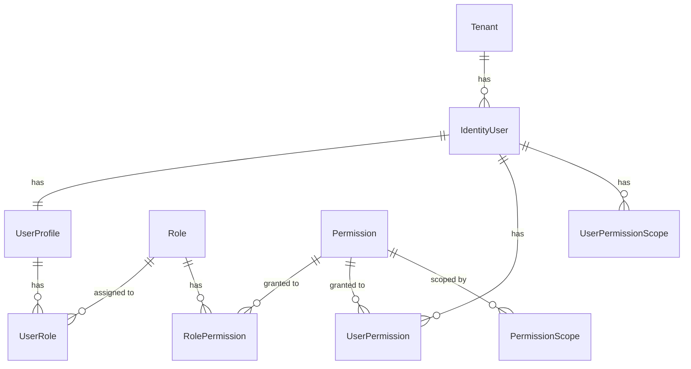
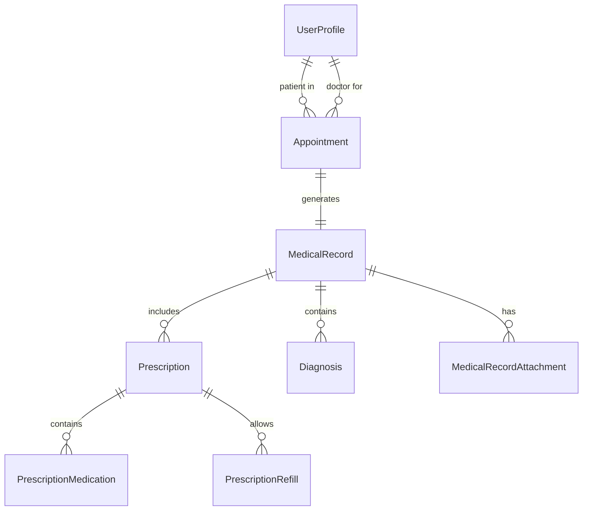
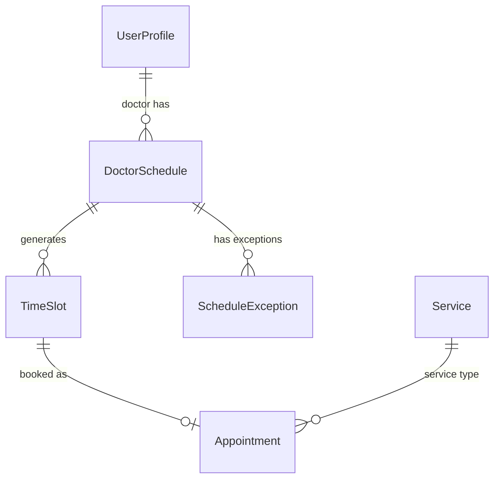
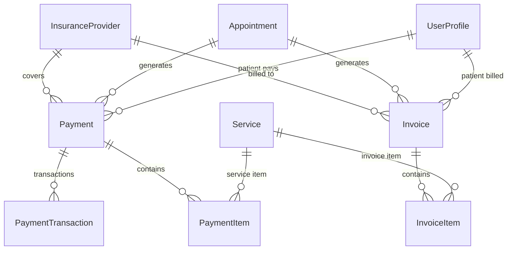
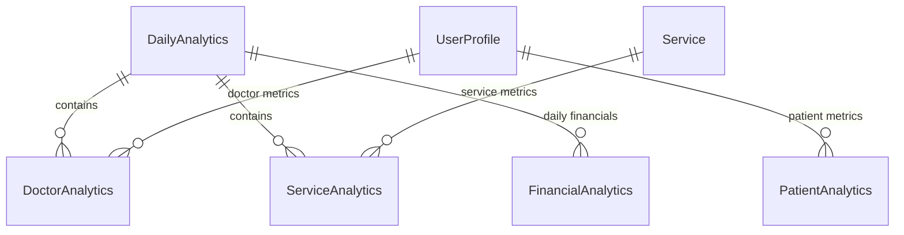

# Tabeebi Clinic Management System - Entity Relationships

## 📊 **Entity Relationship Overview**

This document details all entity relationships in the Tabeebi Clinic Management System, showing the complete data model with foreign keys, navigation properties, and business rules.

## 🏗️ **Core Entity Relationships**

### **1. Identity & User Management**



**Tables:**
- **Tenant** (Multi-tenant root)
- **IdentityUser** (Authentication)
- **UserProfile** (Unified user system with 5 roles)
- **Role** (User roles)
- **Permission** (System permissions)
- **UserRole** (User-Role mapping)
- **RolePermission** (Role-Permission mapping)
- **UserPermission** (Direct user permissions)
- **PermissionScope** (Permission scoping)

### **2. Clinical Workflow Core**



**Key Relationships:**
- **Appointment.PatientId** → **UserProfile.Id** (Patient)
- **Appointment.DoctorId** → **UserProfile.Id** (Doctor)
- **MedicalRecord.AppointmentId** → **Appointment.Id**
- **MedicalRecord.PatientId** → **UserProfile.Id**
- **MedicalRecord.DoctorId** → **UserProfile.Id**

### **3. Scheduling System**



**Scheduling Relationships:**
- **DoctorSchedule.DoctorId** → **UserProfile.Id**
- **TimeSlot.DoctorScheduleId** → **DoctorSchedule.Id**
- **TimeSlot.AppointmentId** → **Appointment.Id** (when booked)
- **ScheduleException.DoctorScheduleId** → **DoctorSchedule.Id**

### **4. Financial System**



**Financial Relationships:**
- **Payment.PatientId** → **UserProfile.Id**
- **Payment.AppointmentId** → **Appointment.Id**
- **Payment.InsuranceProviderId** → **InsuranceProvider.Id**
- **Invoice.PatientId** → **UserProfile.Id**
- **Invoice.AppointmentId** → **Appointment.Id**

### **5. Analytics System**



**Analytics Relationships:**
- **DoctorAnalytics.DoctorId** → **UserProfile.Id**
- **DoctorAnalytics.DailyAnalyticsId** → **DailyAnalytics.Id**
- **ServiceAnalytics.ServiceId** → **Service.Id**
- **PatientAnalytics.PatientId** → **UserProfile.Id**

## 🗂️ **Complete Entity Relationship Matrix**

| **Entity** | **Related To** | **Relationship Type** | **Foreign Key** | **Navigation Property** |
|-------------|----------------|---------------------|-----------------|----------------------|
| **Tenant** | IdentityUser | One-to-Many | TenantId | Users |
| | UserProfile | One-to-Many | TenantId | UserProfiles |
| | Service | One-to-Many | TenantId | Services |
| | Appointment | One-to-Many | TenantId | Appointments |
| **IdentityUser** | UserProfile | One-to-One | IdentityUserId | UserProfile |
| | UserRole | One-to-Many | IdentityUserId | UserRoles |
| | UserClaim | One-to-Many | IdentityUserId | Claims |
| | UserLogin | One-to-Many | IdentityUserId | Logins |
| | UserToken | One-to-Many | IdentityUserId | Tokens |
| **UserProfile** | Tenant | Many-to-One | TenantId | Tenant |
| | IdentityUser | Many-to-One | IdentityUserId | IdentityUser |
| | Appointment (Patient) | One-to-Many | PatientId | PatientAppointments |
| | Appointment (Doctor) | One-to-Many | DoctorId | DoctorAppointments |
| | MedicalRecord (Patient) | One-to-Many | PatientId | PatientMedicalRecords |
| | MedicalRecord (Doctor) | One-to-Many | DoctorId | DoctorMedicalRecords |
| | Prescription (Patient) | One-to-Many | PatientId | PatientPrescriptions |
| | Prescription (Doctor) | One-to-Many | DoctorId | DoctorPrescriptions |
| | Payment (Patient) | One-to-Many | PatientId | PatientPayments |
| | Invoice (Patient) | One-to-Many | PatientId | PatientInvoices |
| | DoctorSchedule | One-to-Many | DoctorId | DoctorSchedules |
| | DoctorAnalytics | One-to-Many | DoctorId | DoctorAnalytics |
| | PatientAnalytics | One-to-Many | PatientId | PatientAnalytics |
| **Appointment** | Patient | Many-to-One | PatientId | Patient |
| | Doctor | Many-to-One | DoctorId | Doctor |
| | Service | Many-to-One | ServiceId | Service |
| | TimeSlot | One-to-One | TimeSlotId | TimeSlot |
| | MedicalRecord | One-to-One | MedicalRecordId | MedicalRecord |
| | Payment | One-to-Many | - | Payments |
| | Invoice | One-to-Many | - | Invoices |
| | Follow-up Appointment | Self-reference | FollowUpAppointmentId | FollowUpAppointment |
| **MedicalRecord** | Patient | Many-to-One | PatientId | Patient |
| | Doctor | Many-to-One | DoctorId | Doctor |
| | Appointment | Many-to-One | AppointmentId | Appointment |
| | Prescription | One-to-Many | - | Prescriptions |
| | Diagnosis | One-to-Many | - | Diagnoses |
| | MedicalRecordAttachment | One-to-Many | - | Attachments |
| **Prescription** | Patient | Many-to-One | PatientId | Patient |
| | Doctor | Many-to-One | DoctorId | Doctor |
| | Appointment | Many-to-One | AppointmentId | Appointment |
| | MedicalRecord | Many-to-One | MedicalRecordId | MedicalRecord |
| | PrescriptionMedication | One-to-Many | - | Medications |
| | PrescriptionRefill | One-to-Many | - | Refills |
| **Payment** | Patient | Many-to-One | PatientId | Patient |
| | Appointment | Many-to-One | AppointmentId | Appointment |
| | InsuranceProvider | Many-to-One | InsuranceProviderId | InsuranceProvider |
| | PaymentItem | One-to-Many | - | Items |
| | PaymentTransaction | One-to-Many | - | Transactions |
| **Invoice** | Patient | Many-to-One | PatientId | Patient |
| | Appointment | Many-to-One | AppointmentId | Appointment |
| | InsuranceProvider | Many-to-One | InsuranceProviderId | InsuranceProvider |
| | InvoiceItem | One-to-Many | - | Items |
| | Payment | One-to-Many | - | Payments |
| **Service** | Tenant | Many-to-One | TenantId | Tenant |
| | Appointment | One-to-Many | - | Appointments |
| | PaymentItem | One-to-Many | - | PaymentItems |
| | InvoiceItem | One-to-Many | - | InvoiceItems |
| | ServiceAnalytics | One-to-Many | - | Analytics |
| **DoctorSchedule** | Doctor | Many-to-One | DoctorId | Doctor |
| | Tenant | Many-to-One | TenantId | Tenant |
| | TimeSlot | One-to-Many | - | TimeSlots |
| | ScheduleException | One-to-Many | - | Exceptions |
| **TimeSlot** | DoctorSchedule | Many-to-One | DoctorScheduleId | DoctorSchedule |
| | Tenant | Many-to-One | TenantId | Tenant |
| | Appointment | One-to-One | AppointmentId | Appointment |
| **Analytics Tables** | Various | Various | Various | Various |

## 🔐 **Multi-Tenant Data Isolation**

### **Tenant-Scoped Entities**
All entities inherit from `BaseTenantEntity` and include:
- **TenantId** (Foreign Key to Tenant table)
- **Row-Level Security** enforced at application level
- **Data Isolation** between tenants

### **Cross-Tenant Relationships**
```
Tenant A Data: ┌─────────────────┐
              │ UserProfile #1  │ ← TenantId = A
              │ Appointment #1  │ ← TenantId = A
              │ Payment #1      │ ← TenantId = A
              └─────────────────┘

Tenant B Data: ┌─────────────────┐
              │ UserProfile #2  │ ← TenantId = B
              │ Appointment #2  │ ← TenantId = B
              │ Payment #2      │ ← TenantId = B
              └─────────────────┘
```

## 📋 **Business Rules & Constraints**

### **Appointment Rules**
- **No Double Booking**: Same doctor, same time slot
- **Working Hours Validation**: Doctor schedule compliance
- **Insurance Verification**: Pre-authorization checks
- **Patient Eligibility**: Active patient status required

### **Medical Record Rules**
- **Digital Signature Required**: Legal compliance
- **Audit Trail**: All changes logged
- **Version Control**: Amendments tracked
- **Access Control**: Role-based permissions

### **Payment Rules**
- **Multi-Method Support**: Cash, card, insurance, online
- **Insurance Integration**: Claim submission tracking
- **Refund Processing**: Proper audit trails
- **Currency Validation**: Tenant currency compliance

### **Scheduling Rules**
- **Conflict Prevention**: Advanced slot management
- **Exception Handling**: Holidays, vacations, emergencies
- **Recurring Patterns**: Weekly, monthly, custom
- **Resource Allocation**: Room and equipment management

## 🎯 **Query Optimization**

### **Indexed Fields**
```sql
-- High-traffic queries
UserProfile.Email (unique)
UserProfile.PhoneNumber
Appointment.ScheduledDateTime
Appointment.PatientId
Appointment.DoctorId
MedicalRecord.CreatedDate
Payment.PaymentDate
Tenant.Subdomain (unique)
```

### **Complex Relationships**
```csharp
// Example: Patient's complete medical history
var patientHistory = await _context.UserProfiles
    .Where(p => p.Id == patientId && p.TenantId == tenantId)
    .Include(p => p.PatientAppointments)
        .ThenInclude(a => a.MedicalRecord)
            .ThenInclude(mr => mr.Prescriptions)
                .ThenInclude(p => p.Medications)
    .Include(p => p.PatientAppointments)
        .ThenInclude(a => a.Payments)
    .FirstOrDefaultAsync();
```

## 🔄 **Data Flow Examples**

### **Patient Appointment Flow**
```
1. Patient Registration → IdentityUser + UserProfile (ProfileType.Patient)
2. Appointment Booking → Appointment entity with TimeSlot reservation
3. Check-in Process → Appointment status updates
4. Medical Record Creation → MedicalRecord linked to Appointment
5. Prescription Generation → Prescription linked to MedicalRecord
6. Payment Processing → Payment linked to Appointment
7. Analytics Update → DailyAnalytics, PatientAnalytics updated
```

### **Doctor Workflow**
```
1. Schedule Management → DoctorSchedule with TimeSlots
2. Appointment View → Doctor's daily appointments
3. Medical Documentation → MedicalRecord creation
4. Prescription Writing → Prescription with medications
5. Analytics Review → DoctorAnalytics performance metrics
```

This relationship model provides a comprehensive foundation for all clinic management operations while maintaining Clean Architecture principles and proper multi-tenant isolation.